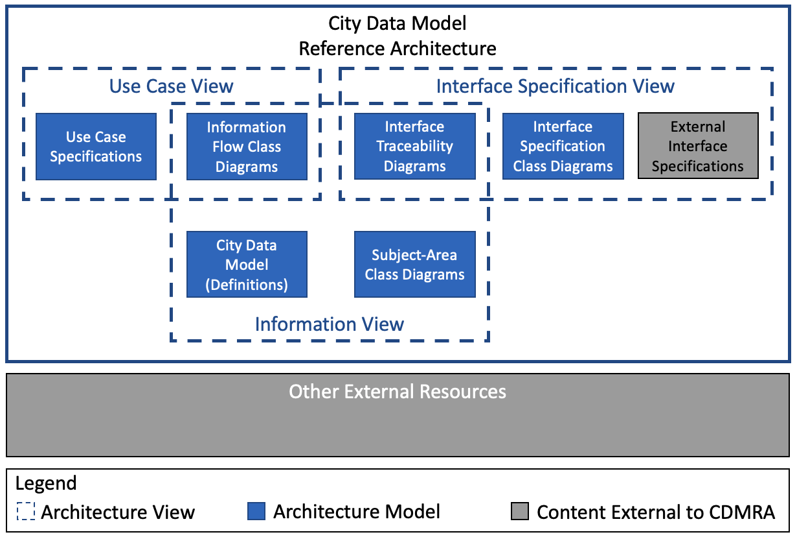
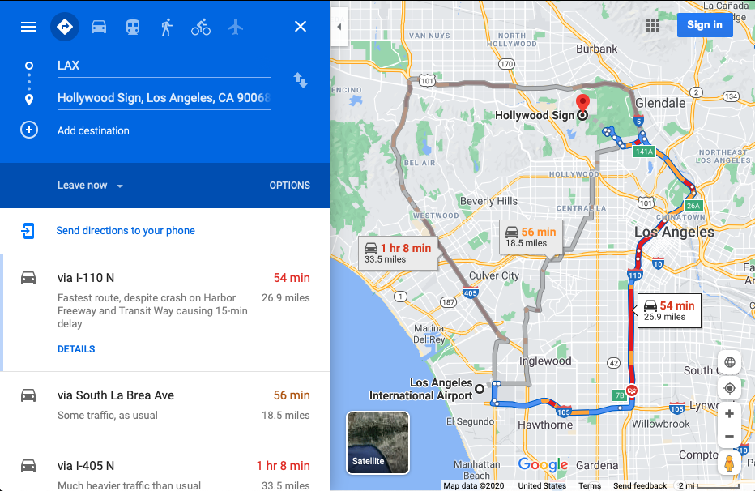
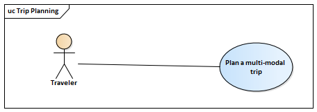
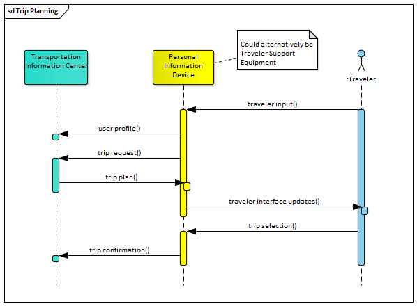
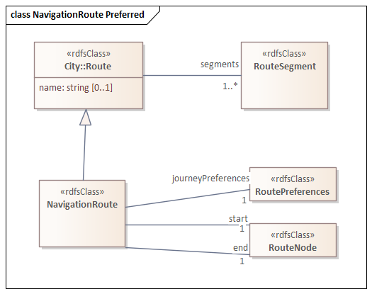

# City Data Model and Reference Architecture: Framework

## Scope of this document
This document defines the architectural framework of the City Data Model and Reference Architecture. This document is intended to be an [Evergreen Standard](Evergreen).

### Purpose of CDMRA

The purpose of the CDMRA is to:

1. assist experts in producing and building consensus around the definitions that are eventually captured in the city data model (CDM) portion of the CDMRA and
2. provide users of these data definitions the necessary context of the data so that they can fully appreciate the intent of the data.

These dual purposes are achieved by supplementing the CDM with the Use Case and Interface Specification Views, which provide justification and context for the data defined by the CDM.

The CDMRA formally defines the CDM; the other components of the CDMRA are only developed to the extent to support the needs of the CDM.

### Purpose of the CDM

The CDM enables city software applications to share information, plan, coordinate, and execute city tasks, and support decision making, by providing a precise, unambiguous representation of information and knowledge commonly shared within and across city services.

### Scope of services covered by the CDMRA (and CDM)

The CDMRA, and by inclusion the CDM, intends to provide a central reference for data definitions used within smart cities. However, it should be recognized that:

- smart cities encompass a huge number of potential services, including those for transport, health care, governance, power, etc.
- the CDMRA project is relatively new (starting in 2020)
- its content is dependent on the contributions of experts from the various areas of smart city services

As present, most of the work is focused on smart transport, including intelligent transport systems and transport planning, but the intent is to include all city services and experts from other service areas are encouraged to contribute.

In fact, the governance process envisioned by this document recognizes that the development of data definitions for any one smart city service often needs to consider the needs of other smart city services so that the data defined by one service can be reused by another. For example, a transport service might monitor the location of a vehicle, but a health care service might need access to that location information if a vehicle occupant has a health issue. If the two services are to be properly integrated, both the transport domain and the health care domain need to agree on how location should be defined, which requires experts from both domains to be involved in the definition of location data.

### Scope of technical specification

The CDMRA intends to define the semantics of city data to a level of detail such that it can be used as a reference for data transformations from one interface format to another. For example, it will define the meaning of data, the relationships among data, and the preferred units for data (or mechanisms for defining units of measure).

The CDM does not attempt to define representational form, encoding formats, or protocols used to exchange the data. However, before any element of the model is fully &quot;approved&quot;, at least one interface specification providing these rules must be identified and registered in the CDMRA. This ensures that the definitions provided in the model reflect real-world usage.

It is envisioned that data transformations will be defined to translate data from specific protocols into their corresponding data elements contained within the CDM. Such transformation rules will facilitate the unambiguous translation of data among different protocols and avoid mistakes in translations. The CDMRA collaboration environment makes provisions to store this type of information but this information is not currently the focus of the CDMRA development.

## Understanding the Model

While the primary goal of the CDMRA is to formally define the CDM, learning the contents of a data model by itself is a bit like trying to learn a language by reading a dictionary. In practice, data models are most useful when presented in small chunks that can be directly related to a practical use of the data.

To promote comprehension, the CDMRA adopts a use-case approach to defining data. The use cases are defined within the Use Case View of the CDMRA using a standard template. Each use case identifies the data required by the use case and typically includes one or more class diagrams that depict the relationships among this data.

The Use Case View also includes hyperlinks into the Information View, which provides additional details about the data, including:

1. Detailed definitions of each data concept required by the use case (the City Data Model)
2. Diagrams depicting how this data relates to other data (e.g., data that might not be used by the specific use case)
3. Links to each use case that uses each class/property `CP: Links to use cases are provided for classes, but not for properties / data elements. Also, this is not a link from the Use Case View into the Information View, but the other direction.`
4. Identification of interface specifications within the Interface Specification View that define how the data is implemented in real-world interfaces `CP: unclear what this is and if this is represented in the Wiki; are these the specifications linked to the use case?`
5. Links to outside resources that provide additional context for the data (e.g., external reference architectures)

The various parts of the CDMRA are summarized in Figure 1.

_Figure 1: City Data Model and Reference Architecture Overview_

## Terms and definitions

The development and uses of the CDMRA crosses several domains, with different stakeholder groups familiar with their own vocabulary. For example, an entity that describes a group of objects that exhibit similar characteristics might be called a:

- unary predicate in First Order Logic (FOL)
- concept in Description Logic (DL) and 
- class in Web Ontology Language (OWL), Unified Modeling Language (UML), and in the vocabulary of ISO 11179 (Metadata registries)
- entity in entity-relationship diagrams and 
- table in database terminology
- aggregate business information entity (ABIE) in UN/CEFACT (https://unece.org/DAM/cefact/codesfortrade/CCTS/CCTS-Version3.pdf)

The CDMRA is heavily based on OWL and the Ontology Definition Metamodel (ODM), which itself is based on UML; therefore the CDMRA typically adopts the terms used by these standards to the extent practical. Synonyms from other communities are noted in the definitions below along with explanantions on how different terms might have slightly different meanings. In some cases, we have also adopted terms from other communities to try to be as precise as possible.

<dt>architecture</dt>

<dt>architecture description</dt>

<dt>architecture framework</dt>

<dt>architecture model</dt>

<dt>architecture model kind</dt>

<dt>architecture view</dt>

<dt>architecture viewpoint</dt>

<dt>association</dt>

<dt>association role</dt>
<dd>property of a specific class that is represented with another defined class</dd>

<dt>attribute</dt>
<dd>property of a specific class that is expressed as an elemental characteristic within a diagram</dd>
<dd>NOTE: An attribute may optionally be associated with a syntax.</dd>
<dd>NOTE: An attribute syntax might reference another defined class; in this case, the same property might be represented as an association role within another class diagram.</dd>
<dd>Synonyms: data element, data element concept</dd>
<dd>NOTE: A data element is associated with a "representational form" (i.e., at least a syntax) while a data element concept is not associated with a syntax. Within the scope of the CDMRA, the association is optional.</dd>

<dt>city data model</dt>
<dd>**Highlight that this is a different type of model than architecture model**</dd>

<dt>class</dt>
<dd>set of ideas, abstractions or things in the real world that are identified with explicit boundaries and meaning and whose properties and behaviour follow the same rules </dd>
<dd>Source: ISO 11179-1:2015</dd>
<dd>Synonyms: unary predicate, concept, entity, table, aggregate business information entity</dd>

<dt>class diagram</dt>

<dt>concern</dt>

<dt>data concept</dt>
<dd>Any of a class, property, attribute, or association role</dd>

<dt>data model</dt>

<dt>generalization</dt>

<dt>inheritance</dt>

<dt>instance</dt>

<dt>ontology</dt>
<dd>formal explicit description of concepts in a domain of discourse</dd>

<dt>pattern</dt>

<dt>property</dt>

<dt>relationship</dt>

<dt>specialization</dt>

<dt>stakeholder</dt>

## Framework

The framework specification contained in this specification conforms to an *architecture framework* as specified in [ISO 42010](ISO42010). Specifically, the document identifies a set of *viewpoints*, each of which is designed to address a specific set of *concerns* held by *stakeholders*. The viewpoints are defined using *model kinds*, which specify modeling conventions to be used for specific presentations of the data. 

According to ISO/IEC/IEEE [ISO 42010](ISO42010), an architecture viewpoint establishes "the conventions for the construction, interpretation, and use of architecture views to frame specific system concerns."

An *architecture description* based on this framework will develop *models* conforming to the model kinds defined by this document and group the models into *views* that correspond to the viewpoints defined in this document. As multiple viewpoints might share similar concerns, the same model kinds and models can be referenced by multiple viewpoints and views.

The viewpoint specifications are based on the [Viewpoint Specification Template](Hilliard1). 

The Use Case Viewpoint specification has been developed in consideration of input based on [Hiiliard2](Hiiliard2), [Kruchten](Kruchten), and [IEEE2413](IEEE2413).

The Information Viewpoint specification was developed in consideration of the specifications defined in [Software Systems Architecture](Rozanski), the [Department of Defense Architecture Framework](DoDAF), [The Open Group Architecture Framework](TOGAF), and the [Zachman Framework](Zachman).

The Interface Specification Viewpoint was developed based on the needs of the CDMRA.

### Usage Viewpoint

`CP: Usage Viewpoint vs Use Case Viewpoint - both are used; as are View and Viewpoint`

#### Overview

The Usage Viewpoint defines the conventions for capturing how city data might be used to meet the needs of various system actors. 

#### Concerns and Stakeholders

Example stakeholders might include [Rozanski]:

-   Developers
-   System Administrators
-   Testers
-   Users

#### Concerns
The following table provides an overview of the stakeholder concerns addressed by this viewpoint along with a specific reference to the model kind (and field) or correspondence rule that addresses the concern.

`Text presented as code indicates items that have not yet reached consensus.`

|Concern|Addressed by Model Kind|
|-------|-----------------------|
|What are the use cases that are driving the data definitions?|Use Case Specification: Name, Summary, Description, and Figures|
|Is the use case definition collaboratory or copyrighted elsewhere?|Use Case Specification: Scenario Licensing, Use Case Specification: Other Licensing Notes|
|What is the context of this use case?|Use Case Specification: Name (shown in structure), Description|
|Who are the participants for this use case?|Use Case Specification: Actors|
|What data needs to be exchanged among participants?|Use Case Specification: Information Requirements `Use Case Specification: Required Classes` `Use Case Specification: Required Object Properties` `Use Case Specification: Required Data Properties` `Unclear how the above can be traced meaningfully` `(i.e., class to property relationships)` Use Case Specification: Figures|
|`What data needs to be generated/accessed`  `internally to the smart city system?`|`If we define internal flows, we need to define internal`  `elements and this is no longer a use case specification - ` `but perhaps what we are trying to achieve is primarily ` `standardizing data among major system components. Thus, ` `perhaps we need at least a high-level deployment viewpoint ` `that at least identifies the major system components that ` `we will consider in our analysis. Actually, the best way ` `to handle this within the scope of our environment is to ` `define a separate use case where the boundary changes so ` `that one of the component systems is defined as an actor.`|
|What are the flow of events for each scenario associated with each use case?|Use Case Specification: Basic Flow of Events Use Case Specification: Flow Exceptions|
|What are the outstanding issues with this use case?|Use Case Specification: Issues|
|What is the source of this use case?|Use Case Specification: Reference(s)|
|What standards/specifications exist related to this use case?|Use Case Specification: Specifications|
|How has this use case evolved over time?|Use Case Specification: Page History|
|What is the approval status of this use case?|Use Case Specification: Status|

#### Concerns not addressed

This viewpoint does not attempt to frame the following stakeholder
concerns:

- What non-participating stakeholders exist for this use case?

#### Model Kinds

The usage viewpoint includes two defined model kinds:

- Use case model kind
- **Information flow class diagram model kind**

Each use case shall be associated with one use case specification model. Each use case specification model may include supplemental figures, which can include zero or more information flow class diagram models. Each information flow class diagram model depicts the information from the CDM that is used by the use case; information flow class diagram models are often associated with multiple use cases. 

`NOTE: Documenting as above implies that two use cases that use the same information will each include the same information flow class diagram as static figures. As the CDM matures, these figures will not be automatically updated. As a result, they might become dated.`

Information flow class diagram models depict the content of the City Data Model; thus, the typical work flow is:

1. The use case specification is developed
2. A notional information flow class diagram is conceptualized (i.e., might not be shown within the CDMRA)
3. The notional information flow class diagram is harmonized with the existing content of the CDM (i.e., part of the Information View); this might entail adding new data elements to the CDM, revising existing data elements, and revising the notional information flow class diagram model to conform to the revised CDM
4. Developing a final information flow class diagram model 
5. `Linking (or with the revised flow, perhaps copying) the information flow class diagram model to the use case specification`

Thus, initial versions of a use case model are likely not to include an information flow class diagram model or might only include a notional diagram.  However, once fully specified, the use case model should provide `a link to the information flow class diagram model, which will be fully consistent with the content of the CDM.` The information flow class diagram model kind is a part of both the Use Case Viewpoint and the Information Viewpoint and is formally defined in the Information Viewpoint section. 

#### Use Case Model Kind

The use case model kind provides a template that is to be used to define all use cases defined within the Usage View. The template is defined as follows:

**Boldface text indicates items that have been approved but are not yet reflected in the online tool.** _Italicized text indicates items that equate to existing online tool fields where some minor change is still needed (e.g., name change of field)._ `Text presented as code indicates items that have not yet reached consensus.`

|Field|Description|Conformance|
|-----|-----------|-----------|
| _Use Case Name_ |Name of use case as a hierarchical field of the format  \<Domain\>: \<Subdomains\>: \<Use Case\> The domain field should be one of the following strings: `????`  The subdomains field should indicate a hierarchical list of subdomains as defined by the domain. `CP: the page name is just a string, so the hierarchy would "just" be a naming convention and the domains/sub-domains are not represented in the Wiki as resources?` |Mandatory|
| **Summary** |Short description (\<= 280 characters).  The summary should identify the goal and one or more value proposition(s) in the form **«[\<Verb\>] \<direct object\>»**  For example:  This use case describes how a user might plan a driving trip from a source to a destination. This use case focuses on ensuring the following user benefits: <ul><li>[Improve] travel efficiency</li><li>[Improve] driver expectations</li><li>[Reduce] driver confusion</li></ul>|Mandatory|
| _Description_ |A more extended description of the use case. The purpose of the CDMRA is to develop the data model, as such, the description does not need to provide full details, but it should provide sufficient context to provide insight into the data that needs to be exchanged and processed. `CP: Why is this in italics, not bold?`|Mandatory|
| _Figures_ |An illustration that might assist the user in better understanding the scenario. The illustration should be explained by either the description or the flow of events. `CP: Why is this in italics, not bold? Done`|Optional|
|Actors|Parties that directly interact with the system for this use case. `CP: Should this be bold? Done Italics?`|Mandatory|
|Basic Flow of Events|The sequence of events that occur during the normal flow of this use case with any notes. `CP: Should this be bold? Done`|Mandatory|
| **Flow Exceptions** |Highlighted alternative flow of events that reveal the need for additional data to be exchanged among the actors of the use case.|Optional|
| **Information Requirements** |This is a very high-level description, for example, "origin location, destination location, and travel preferences". Details can be hashed out later and shown in the diagrams; this can be updated later to provide correspondence linkages to the defined data concepts in the Information View. While not technically required to define a use case, this field should be populated prior to beginning work on the data definitions|Optional|
|Required Classes|Links to CDM `Should this be linked with the following two so that we say something` `like "Vehicle.speed" with both Vehicle and speed linked to their` `respective attributes so that the reader understands that the` `"speed" attribute is describing "Vehicle"?.` Should eventually be populated once CDM contains data for use case.|Optional|
|Required Object Properties|Links to CDM. Should eventually be populated once CDM contains data for use case.|Optional|
|Required Data Properties|Links to CDM. Should eventually be populated once CDM contains data for use case.|Optional|
| **Issues** |Primarily to track issues during development `Perhaps link to github issues?`|Optional|
| **Reference(s)** |Source materials used to develop this use case|Optional|
|`Version`|`The date, version number, and status of the use case in the form` `YYYY-MM-DD #.#.#-S; See governance for details` `Do we need both version and status?`|Mandatory|
| **Status** |Approval status|Mandatory|
| **Specifications** |Link to reference architectures, standards and other resources that rely upon this use case definition|Optional|
| _License information_ |Indicate the owner and provide a reference to the copyright information|Mandatory|

##### `Operations for Use Case Models`

When initially creating a use case model, the following fields shall be populated, as a minimum, prior to considering the use case definition complete:

- Name
- Summary
- Description
- Actors
- Basic flow of events
- Version
- Status
- License information

##### `Correspondence Rules for Use Case Models`

Each use case model should eventually be linked to the CDM data concepts that are needed to implement the Information Requirements defined bty the use case. These linkages are stored within CDM by associating each required data concept to the use case(s) that use them.

#### `Operations for Naming Use Cases`

Use cases should be named so that users can easily search and find use cases within a long list. This document recommends using a standard list of subdomains for each domain. For example, in the case of the ITS domain, use cases should be categorized according to the services groupings defined in ISO 14813-1.

#### `Correspondence Rules for Usage Views`

The usage view includes the following correspondence rules with other views and resources:

- The domain and subdomain values used within each use case model should be selected from pre-defined lists
- Actors should be defined in a separately maintained list
- The source should cite a publicly available document
- The specifications shall cite an entry in the specification view
- The information flow class diagram shall be a diagram showing only those elements from the Information View that are relevant to this use case
- The interaction diagram of the scenario model might also be contained within a deployment or similar view of another reference architecture

#### `Example`
|Field|Value|
|-----|-----------|
|Use Case Name|<a name="UCexample">ITS: Traveller Information: Real-time route guidance and information: Dynamic in-vehicle route guidance using real-time information: Routing a vehicle between two known points</a>|
|Summary|A traveler wants to identify options for travelling from an origin to a destination given a set of personal preferences and the likely duration of such a trip using different modes of travel.<ul><li>[Improve] transportation efficiency</li><li>[Improve] traveler expectations</li></ul>|
|Description|A traveler wishes to plan a trip from an origin to a destination and compare several options.  The trip may involve and/or compare multiple modes of transport. The traveler may define preferences up front and choose how to sort the options presented. The traveler might wish to refine the details of some or all of the trip legs prior to finalizing the selection. The proposed route might be visually displayed to the traveler, as in the illusrtation, to assist in selecting among the presented options.|
|Figures| _Figure 1: Route Options for Los Angeles Airport (LAX) to Hollywood Sign_  _Figure 2: Trip Planning Use Case_  _Figure 3: Use case sequence diagram_|
|Actors|<ul><li>[Traveler](https://local.iteris.com/arc-it/html/physobjects/physobj64.html)</li><li>[`Traveler Support Equipment`](https://local.iteris.com/arc-it/html/physobjects/physobj72.html)</li><li>[`Personal Information Device`](https://local.iteris.com/arc-it/html/physobjects/physobj23.html)</li><li>[Transportation Information Center](https://local.iteris.com/arc-it/html/physobjects/physobj17.html)</li></ul>|
|Basic Flow of Events|<ol><li>Traveler signs into their account, if needed</li><li>Traveler inputs details of trip request through user interface</li><li>User interface optionally logs into user account at Traveler Information Center and/or provides user profile information</li><li>User interface device sends the specific trip request to a Transportation information Center</li><li>Transporation Information Center responds to the User Interface Decvice with a list of alternate trip plans</li><li>User interface presents the alternate trip plans to the traveler</li><li>The traveler optionally selects one of the trips and authorizes charges</li><li>The User Interface Device reserves the trip with the Transportation Information Center</li></ol>|
|Flow Exceptions|<ul><li>Traveler might revise preferences after seeing alternative trip plans.</li><li> Transportation Information Center might not be able to identify a viable route.</li></ul>|
|Information requirements|<ul><li>IN<ul><li>Origin</li><li>Destination</li><li>Traveler Preferences (optional)</li><li>Desired departure time (optional)</li><li>Desired arrival time (optional)</li></ul></li><li>OUT<ul><li>List of route alternatives</li></ul></li></ul>|
|Required Classes|<ul><li>[OGC:Route](http://citydata.utoronto.ca/index.php/Ogc:Route), [NavigationRoute](http://citydata.utoronto.ca/index.php/NavigationRoute)</li></ul>|
|Required Object Properties||
|Required Data Properties||
|Issues|The data for this use case has not been defined yet.|
|References|<ul><li>[ISO 14813-1:2015](https://www.iso.org/standard/57393.html) (defines subdomain/service)</li><li>[ARC-IT 9.0: Infrastructure-Provided Trip Planning and Route Guidance](https://local.iteris.com/arc-it/html/servicepackages/sp163.html#tab-3) (sample physical view)</li></ul>|
|Version|2021-01-12 (0.0.3-D)|
|Status|draft|
|Specifications|<li>[SAE J2353](https://www.sae.org/standards/content/j2353_201906/) (defines data for traveler information) </li>|
|License information|[W3C Document License](https://www.w3.org/Consortium/Legal/2015/doc-license)|

#### `Notes`
\<Any?\>

### Information Viewpoint

#### Overview

The Information Viewpoint frames how stakeholder concerns related to information will be addressed, especially those related to the structure and semantics of information.

#### Stakeholders

The Information Viewpoint considers concerns from the following stakeholders:

1. Data custodians
2. Data stewards
3. Designers, developers, and integrators
4. System managers
5. Users, including
	1.  End users
	2.  Field support users
	3.  System operators
	4.  Administrative users
	5. Standardization bodies

#### Concerns

The following table identifies the stakeholder concerns considered in the development of this viewpoint. Each concern is categorized into a generalized topic area and includes a reference to the model kind where the concern is addressed. 

|Topic|Concern|Addressed by Model Kind|
|-----|-------|-----------------------|
Data Definition|What are the definitions of the major business terms (classes) used within the CDM?|Class: Specification|
Data Definition|How do classes relate to one another?|Class: Class-focused ODM diagram, Specification|
Data Definition|What are the known attributes of a class?|Class: Class-focused ODM diagram, Specification|
Data Definition|What is the meaning of each property?|Property: Specification|
Data Definition|What, if any, state behavior relationships are there for classes?|Class: State Machine|
Data Definition|What is the preferred abstract syntax of the data element? |Class: Specification: Value Restriction for Property|
Data Quality|What are the constraints on data values?|Class: Specification: Value Restriction for Property|
Data Standardization|What use cases use this data?|Class/Property: Use Cases|
Data Evolution|What is the status of the data definition?|Class/Object Property/Data Property: Status|
Data Evolution|How has the data model changed over time?|Class/Property: Page history|
Data Evolution|What use case was the data originally designed for?|Class/Property: Page history|
Data Evolution|What is the evolutionary history of the data element?|Class/Property: Page history|
Data Evolution|When was the definition last modified?|Class/Property: Page history|
Data Evolution|What was the last change to the data definition?|Class/Property: Page history|

- How are inputs from multiple sources handled?
- What data is required and under what conditions?
- Who produces/writes the data?
- Who consumes/reads the data?
- What metadata must be supported and under what conditions?
- What auditing trails are required?
- How does each data element relate to older versions?

`What about links to the Interface specifications?`

#### Concerns not addressed

This viewpoint does not attempt to frame the following stakeholder
concerns:

-   What operations can be supported for each data element or class? `CP: how is this related to the "functions" mentioned above?`
-   How is data accessed/exchanged with internal and external systems?
-   How are access control rights are maintained (e.g., removing rights
    for a terminated employee)?
-   What are the physical infrastructure requirements (e.g., for data
    storage)?
-   What are the costs involved in deploying, operating and maintaining
    the data?
-   What potential legal liability is associated with maintaining data
    stores?
-   How are data sources located?
-   How are data ownership and access right conflicts resolved?
-   How does a user gain permission to access the data?
- What external policies and legislation needs to be considered for the
data? (e.g., GDPR)
- What information transfers use the data?
- Does the data represent sensitive information (e.g., personally
identifiable information)?
- What level of data access control is needed?
- How is data access controlled?
- What cybersecurity and data privacy standards apply? (NITS WP-692 Item
15)
- What are the data accuracy requirements?
- How is data quality captured (e.g., sensor issues, conflicts among
inputs, etc)?
- What measures are needed to detect and quash bad data?
- How are constraints on data values enforced (i.e., prevent buffer
overflow, invalid content, etc.)?
- How is bad or missing data reported?
- How is the data protected from unauthorized modification?
- How does a receiver validate that the information was produced by a
legitimate source? (e.g., a MAP message sent by an RSU)
- How quickly does the data age?
- How is the data kept up to date?
- How is outdated data flagged?
- How is data synchronized and conflicts resolved among multiple entities?
- What are the latency requirements for the data?
- Who last edited the data?
- When was the data last updated?
- Who has accessed the data?
- Who is responsible for data quality?
- Are there penalties for bad behavior (e.g., releasing data)? Who
decides/enforces? What are options?
- Where is the data stored (if at all)?
- What persistence requirements exist for the data?
- How is the data (and all copies) destroyed?
- What data must be supported by a device and under what conditions (e.g.,
for which services)?
- Does the data element need to be shared in an interoperable fashion? (or perhaps proprietary or out of scope)
- Does the data represent aggregated/fused data?
- Who has what rights to specific aggregated/fused data?
- What dynamic metadata exists regarding the employed analytic methods used to produce the aggregated/fused data?
- Can the algorithms and parameters used to aggregate/fuse the data be
controlled?
- Who owns the data?
- What rights does a user of the data have?
- What restrictions are there on the data (sharing, derived data, etc.)?
- What responsibilities does a data provider have?
- What responsibilities does a data consumer have?
- How are ownership and usage rights controlled, expressed, and exchanged?
- Does the data have safety-of-life implications?
- How is data transformed from one data exchange format into another?
- What known gaps/overlaps exist between the defined use cases and the existing data definitions?
- What interface standards include this data element?

These issues are left for domain, solution, or implementation-specific documentation.

#### Model Kinds

The Information Viewpoint consists of the following model kinds ([MK comment: I think we opted to omit some of these]) `CP: We also need to discuss, how the model kinds are represented in the Wiki. Are these all mapped to Classes, Object and Data Properties and certain pages/fields of the page will then be only relevant for certain views?`:

-   Class Specification Model Kind
-   Property Specification Model Kind
-   City Data Model Kind

`Model Kinds not included at present:`

-   `Data Ownership Model Kind`
-   `Information Lifecycle Model Kind`
-   `Timeliness and Latency Model Kind`
-   `Archive and Retention Model Kind`

#### Class Specification Model Kind

The class specifiaction model kind is a template that is used to provide formal definitions of each class within the CDM. 

##### Conventions

The template for the class specification is defined as follows; all information is presented in a table other than the Class Name, which is used as the page title:

**Boldface text indicates items that have been approved but are not yet reflected in the online tool.** _Italicized text indicates items that equate to existing online tool fields where some minor change is still needed (e.g., name change of field)._ `Text presented as code indicates items that have not yet reached consensus.`

|Field|Description|Conformance|
|-----|-----------|-----------|
| Class Name |Name of class within its defined context  \<Context\>::\<Name\> The context and name should be in UpperCamelCase. |Mandatory|
| _Definition_ |Textual definition of the class in English|Mandatory|
| _Specification_ |Formalized Manchester Syntax representation of the definition|Optional|
| _Subject Area Class Diagram_ |Link(s) to class diagram(s) that depicts the object properties (i.e., associations) and data properties (i.e., attributes) that have been defined for the class in the harmonized CDM. |Optional|
|State Machine Diagram|Depiction of the defined states for objects of the class and teh allowed transitions between states|Optional|
|State Machine Description|Textual description of the state machine diagram|Conditional (required if state machine defined)|
|Use Cases|Link(s) to use case(s) where this data concept is used |Conditional (if exists)|
|Sources|The source(s) considered when developing the class|Optional|
| Status |Status of the data concept per the states defined in the Governance document.|Mandatory|
| Specializations |Classes that further specialize this class|Conditional (if exists)|

##### `Operations for Class Specifiactions`

When initially creating a class specification, the following fields shall be populated, as a minimum, prior to considering the specification complete:

- Name
- Definition
- Status

###### Customizing a Class 
Extending a class to support additional domain or implementation-specific data

##### `Correspondence Rules for Class Specifications`

Each class specification should eventually be linked to:

- The use case(s) that rely upon the class
- The generalized classes from which the class is derived
- The specialized classes that derive from the class
- The properties that have been identified for the class

##### Example

The following text provides an example of how a Class Specifiaction might appear within the CDMRA. Terms shown as hyperlinks would be linked to other appropriate pages within the CDMRA; however, as this is just an example, those links are not active. 

***
### ITS::NavigationRoute

<pre> <b>Contents</b>
<a>Class Diagram</a>
<a>Specification</a>
<a>State Machine</a>
<a>Use Case References</a>
<a>CDM References</a>
<a>Interface Specification References</a>
<a>Status</a>
</pre>

#### Class Diagram

#### Annotation

|Property       |Value Restriction                      |
|---------------|---------------------------------------|
|[rdfs:comment]()| Route used to define a traveller's path from an origin|
|[rdfs:label]()||

https://www.w3.org/TR/owl2-syntax/#Annotation_Properties
seeAlso
isDefinedBy
versionInfo
priorVersion
backwardCompaticbleWith
incompatibleWith
*deprecated

#### Specification

|Property       |Value Restriction                      |
|---------------|---------------------------------------|
|[rdfs:subClassOf]()|[Route]()|
|[start]()      |exactly 1 [RouteNode]()|
|[end]()        |exactly 1 [RouteNode]()|
|[journeyPreferences]()|exactly 1 [RoutePreferences]()|

#### State Machine 

There is no state machine defined for this class.

#### Use Case References

This class is refereced by the following use cases:

- [ITS: Traveller Information: Real-time route guidance and information: Dynamic in-vehicle route guidance using real-time information: Routing a vehicle between two known points](#UCexample)|

#### CDM References

This class is refereced by the following other elements of the CDM:

- [DrivingNavigationRoute]()
- [PublicTransportNavigationRoute]()
- [MultimodalNavigationRoute]()

####Interface Specification References

This class has been associated with the following interface specification items:

- [SAE J2353]() - Route 

####Status

draft
***

#### Property Specifiaction Model Kind

The property specifiaction model kind is a template that is used to provide formal definitions of each property within the CDM. 

##### Conventions

The template for the property specification is defined as follows:

**Boldface text indicates items that have been approved but are not yet reflected in the online tool.** _Italicized text indicates items that equate to existing online tool fields where some minor change is still needed (e.g., name change of field)._ `Text presented as code indicates items that have not yet reached consensus.`
The Ontology Model Kind is used to specify relationships among key business terms. It is roughly equivalent to IEEE 2413 semantic model kind.

|Field|Description|Conformance|
|-----|-----------|-----------|
| _Property Name_ |Fully-qualified name of property (i.e., indicating any specializations)  The name should be in lowerCamelCase. |Mandatory|
| _Definition_ |Textual definition of the property in English|Mandatory|
| _Specification_ |Formalized Manchester Syntax representation of the definition|Optional|
| _Syntax_ |Link(s) to class(es) (for object properties) or elemental syntax (for data properties) that can be used to represent this property, in rough preferred order |Optional|
| _Use Cases_ |Link(s) to use case(s) where this property is used|Optional|
| _Used by_ |Link(s) to classes that include this property|Optional|
| _Sources_ |The source(s) considered when developing the class|Optional|
| _Status_ |Status of the data concept per the states defined in the Governance document.|Mandatory|
| _Specializations_ |Properties that further specialize this property|Optional|

##### Operations

When initially creating a property specification, the following fields shall be populated, as a minimum, prior to considering the specification complete:

- Name
- Definition
- Status

##### Correspondence Rules

Each property specification should eventually be linked to:

- The use case(s) that rely upon the property
- The generalized property from which the property is derived
- The specialized properties that derive from the property

##### Example

The following text provides an example of how a Property Specifiaction might appear within the CDMRA. Terms shown as hyperlinks would be linked to other appropriate pages within the CDMRA; however, as this is just an example, those links are not active. 

***
### hasStartWaypoint
<pre> <b>Contents</b>
<a>Specification</a>
<a>Use Case References</a>
<a>CDM References</a>
<a>Interface Specification References</a>
<a>Status</a>
</pre>

#### Annotations

|Characteristic |Value (if applicable)                  |
|---------------|---------------------------------------|
|[rdfs:comments]()|The point at which a journey has, does, or is estimated to begin|

#### Specification

|Characteristic |Value (if applicable)                  |
|---------------|---------------------------------------|
|[subPropertyOf]()|[properPartOf]()|

#### Use Case References

This property is refereced by the following use cases:

- [ITS: Traveller Information: Real-time route guidance and information: Dynamic in-vehicle route guidance using real-time information: Routing a vehicle between two known points](#UCexample)|

#### CDM References

This property is refereced by the following other elements of the CDM:

- [NavigationRoute]()

####Interface Specification References

This class has been associated with the following interface specification items:

- [SAE J2353]() - Route 

####Status

draft
***

#### City Data Model Kind

The City Data Model Kind defines the conventions and rules for the City Data Model (CDM), which is a single logical data model that incorporates all of the data concepts contained within the CDMRA into a single coherent model. Due to the scope and size of this model, it is envisioned that virtually all systems that incorprate data defined by the CDM will simplify the model into a physical data model to meet practical system needs (e.g., for coding, processing, and memory efficiency).

While the City Data Model Kind is intended to be instantiated with a single model, the model kind includes three types of diagrams and it is expected that the model will include multiple instances of each type of diagram kind. These relationships are shown in Figure X.

Figure X 

##### Conventions

All three of the diagrams used by the City Data Model Kind shall conform to the conventions of the Unified Modeling Language (UML) class diagram and to the Ontology Definition Metamodel (ODM) version 1.1 profile for the Web Ontology Language (OWL) (i.e., Section 14 of ODM v1.1).

Properties may be depicted in any of the three formats allowed by ODM v1.1 (i.e., an attribute, an association role, or an association class). In most cases, except when displaying relationships among properties, the preferred format is to show data properties as attributes and object properties as associations.

The model is portrayed using three diagram kinds:

- Subject area class diagrams, which focus on a class and its attributes and relationships 
- Information flow class diagrams, which focus on the data used in an information flow of a use case
- Interface specification traceability diagrams, which focus on how the data contained in the CDM relates to data defined in interface specifications

##### Operations

CDM diagrams should generally contain no more than twenty classes to promote understandability of the diagram.

##### Correspondence Rules

Each class contained within a CDM diagram shall be associated with a Class specification model.

Each property (i.e., attribute, association role, or association class) within a CDM class diagram shall be associated with a Property specification model.

### Interface Specification Viewpoint

#### Overview

The Interface Specification Viewpoint frames how stakeholder concerns related to implementations will be addressed, especially those related to understanding how data defined in interface specifications relate to the CDM and how data defined in the CDM is used in standards.

#### Stakeholders

The Interface Specification Viewpoint considers concerns from the following stakeholders:

1. Data custodians
2. Data stewards
3. Designers, developers, and integrators
4. System managers
5. Users, including
	1.  End users
	2.  Field support users
	3.  System operators
	4.  Administrative users
	5. Maintainers
	6. Testers
	7. Standardization bodies
	8. Privacy advocates

#### Concerns

The following table identifies the stakeholder concerns considered in the development of this viewpoint. Each concern is categorized into a generalized topic area and includes a reference to the model kind where the concern is addressed. 

|Concern|Addressed by Model Kind|
|-------|-----------------------|
|What interface specifications use the data covered by the CDM?||
|How can data be transformed between the formats defined by an interface specification and the CDM?||
|Where is the data in my interface specification covered by the CDM?||

#### Concerns not addressed

#### Interface Specification Model Kind

The interface specification model kind records basic information about each interface specification referenced by the CDMRA.

Interface specifications, even when based on object-oriented models, typically have constraints that will result in differences between their models and the CDM. The CDM will tend to have multiple layers of abstraction and complexity that need to be avoided in software deployments for practical reasons. There may also be differences due to differences in presentation needs, accuracy needs, legacy issues, etc. These differences necessitate a mapping between the defined interface specifications and a common logical model. By mapping all interface specifications to a common logical model, data transformations can more easily be achieved among any two interface specifications.

##### Conventions

The template for the interface specification is defined as follows:

**Boldface text indicates items that have been approved but are not yet reflected in the online tool.** _Italicized text indicates items that equate to existing online tool fields where some minor change is still needed (e.g., name change of field)._ `Text presented as code indicates items that have not yet reached consensus.`
The Ontology Model Kind is used to specify relationships among key business terms. It is roughly equivalent to IEEE 2413 semantic model kind.

|Field|Description|Conformance|
|-----|-----------|-----------|
| _Interface Specification Name_ |Name of the specification. |Optional|
| _Interface Specification Identifier_ |Identifier for the specification. |Conditional (required if name not provided)|
|Reference||
|Type|Interface,data specification|
| _Description_ |Short explanation of the interface specification, such as an abstract |Mandatory|
|License||
|Other License Notes||
| _Classes used_ |Links to classes in the CDM that have been traced to the interface specification|Optional|
| _Properties used_ |Links to properties in the CDM that have been traced to the interface specification|Optional|
| _Interface Traceability Diagrams_ |Link(s) to the interface raceability diagrams of the CDM that depict the specific trace relationships|Optional|

##### Operations

Update the governance document to show that drafts can have PNG/JPG diagrams of figures embedded while approved items need to be entered into a central model that is linked to.

Use Enterprise Architect as the central model (with exports to XMI)

##### Correspondence Rules

Elements from the interface specifiaction should correspond to elements of the CDM.

#### Operations on Views

#### Correspondence Rules

#### Examples

#### Notes

#### Sources

## A. References

### A.1 Normative references

**[DoDAF]**  
[Department of Defense Architecture Framework Version 2.02.](https://dodcio.defense.gov/Library/DoD-Architecture-Framework/) U.S. Department of Defense. Published. URL: https://dodcio.defense.gov/Library/DoD-Architecture-Framework/

**[Hiiliard2]**  
Reference not found.

**[Hilliard1]**
Reference not found.

**[IEEE2413]**
Reference not found.

**[ISO42010]**  
[Systems and software engineering — Architecture description.](https://www.iso.org/standard/50508.html) ISO/IEC/IEEE. Published. URL: https://www.iso.org/standard/50508.html

**[Kruchten]**  
Reference not found.

**[Rozanski]**  
[Software Systems Architecture - Second Edition: Working with Stakeholders Using Viewpoints and Perspectives.](https://www.viewpoints-and-perspectives.info/home/book/) Rozanski and Woods. Published. URL: https://www.viewpoints-and-perspectives.info/home/book/

**[TOGAF]**  
[TOGAF — The Open Group Architecture Framework, Version 8.1.1.](https://pubs.opengroup.org/architecture/togaf8-doc/arch/toc.html) The Open Group. Published. URL: https://pubs.opengroup.org/architecture/togaf8-doc/arch/toc.html

**[Zachman]**  
[Zachman Framework.](https://www.zachman.com/images/ZI_PIcs/ZF3.0.jpg) Published. URL: https://www.zachman.com/images/ZI_PIcs/ZF3.0.jpg

ODM: https://www.omg.org/spec/ODM/1.1/PDF  Section 14.2

### A.2 Informative references

**[Evergreen]**  
[Evergreen Standards.](https://www.w3.org/wiki/Evergreen_Standards) W3C. Published. URL: https://www.w3.org/wiki/Evergreen_Standards
