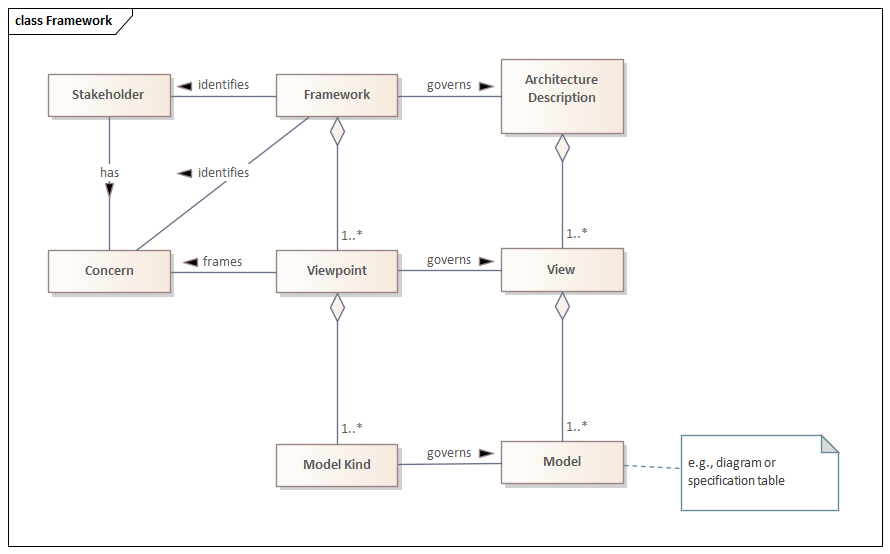

# City Data Model and Reference Architecture: Framework

## Scope of this document

This document defines the architectural framework of the City Data Model and Reference Architecture. This document is intended to be an [Evergreen Standard](Evergreen).

### Purpose of CDMRA

The purpose of the CDMRA is to:

1. assist experts in producing and building consensus around the definitions that are eventually captured in the city data model (CDM) portion of the CDMRA and
2. provide users of these data definitions the necessary context of the data so that they can fully appreciate the intent of the data.

These dual purposes are achieved by supplementing the CDM with the Use Case and Interface Specification Views, which provide justification and context for the data defined by the CDM.

The CDMRA formally defines the CDM; the other components of the CDMRA are only developed to the extent to support the needs of the CDM.

### Purpose of the CDM

The CDM enables city software applications to share information, plan, coordinate, and execute city tasks, and support decision making, by providing a precise, unambiguous representation of information and knowledge commonly shared within and across city services.

### Scope of services covered by the CDMRA (and CDM)

The CDMRA, and by inclusion the CDM, intends to provide a central reference for data definitions used within smart cities. However, it should be recognized that:

- smart cities encompass a huge number of potential services, including those for transport, health care, governance, power, etc.
- the CDMRA project is relatively new (starting in 2020)
- its content is dependent on the contributions of experts from the various areas of smart city services

At present, most of the work is focused on smart transport, including intelligent transport systems and transport planning, but the intent is to include all city services and experts from other service areas are encouraged to contribute.

In fact, the governance process envisioned by this document recognizes that the development of data definitions for any one smart city service often needs to consider the needs of other smart city services so that the data defined by one service can be reused by another. For example, a transport service might monitor the location of a vehicle, but a health care service might need access to that location information if a vehicle occupant has a health issue. If the two services are to be properly integrated, both the transport domain and the health care domain need to agree on how location should be defined, which requires experts from both domains to be involved in the definition of location data.

### Scope of technical specification

The CDMRA intends to define the semantics of city data to a level of detail such that it can be used as a reference for data transformations from one interface format to another. For example, it will define the meaning of data, the relationships among data, and the preferred units for data (or mechanisms for defining units of measure).

The CDM does not attempt to define representational form, encoding formats, or protocols used to exchange the data. However, before any element of the model is fully &quot;approved&quot;, at least one interface specification providing these rules must be identified and registered in the CDMRA. This ensures that the definitions provided in the model reflect real-world usage.

It is envisioned that data transformations will be defined to translate data from specific protocols into their corresponding data elements contained within the CDM. Such transformation rules will facilitate the unambiguous translation of data among different protocols and avoid mistakes in translations. The CDMRA collaboration environment makes provisions to store this type of information but this information is not currently the focus of the CDMRA development.

## Understanding the City Data Model and Reference Architecture

While the primary goal of the CDMRA is to formally define the CDM, learning the contents of a data model by itself is a bit like trying to learn a language by reading a dictionary. In practice, data models are most useful when presented in small chunks that can be directly related to a practical use of the data.

To promote comprehension, the CDM is developed as one view of a larger reference architecture (RA), which was developed according to the rules of ISO 42010 (*System and software engineering — Architecture description*). The CDMRA provides a use-case-driven approach to defining data. The use cases are defined within the Use Case View of the CDMRA using a standard template. Each use case identifies the data required by the use case and typically references one or more information flow class diagrams that depict the relationships among this data.

The Use Case View also includes hyperlinks into the Information View, which provides details about the data, including:

1. Detailed definitions of each data concept required by the use case (the City Data Model)
2. Subjecxtc area class diagrams depicting how this data relates to other data (e.g., data that might not be used by the specific use case)
3. Reverse links to each use case that uses each class/property
4. Identification of interface specifications within the Interface Specification View that define how the data is implemented in real-world interfaces
5. Links to outside resources that provide additional context for the data (e.g., external reference architectures)

The various parts of the CDMRA are summarized in Figure 1.

<figure class="image">
  
  <figcaption>Figure 1: City Data Model and Reference Architecture Overview</figcaption>
</figure>

## Terms and definitions

The development and uses of the CDMRA crosses several domains, with different stakeholder groups familiar with their own vocabulary. For example, an entity that describes a group of objects that exhibit similar characteristics might be called a:

- unary predicate in First Order Logic (FOL)
- concept in Description Logic (DL)
- class in Web Ontology Language (OWL), Unified Modeling Language (UML), and in the vocabulary of ISO 11179 (Metadata registries)
- entity in entity-relationship diagrams
- table in database terminology
- aggregate business information entity (ABIE) in UN/CEFACT (https://unece.org/DAM/cefact/codesfortrade/CCTS/CCTS-Version3.pdf)

The CDMRA is heavily based on OWL and the Ontology Definition Metamodel (ODM), which itself is based on UML; therefore the CDMRA typically adopts the terms used by these standards to the extent practical. Synonyms from other communities are noted in the definitions below along with explanations on how different terms might have slightly different meanings. In some cases, we have also adopted terms from other communities to try to be as precise as possible.

### Terms Imported from Other Specifications

#### Terms imported from ISO 42010:2011

<dt>architecture</dt>
<dd>fundamental concepts or properties of a system in its environment embodied in its elements, relationships, and in the principles of its design and evolution</dd>

<dt>architecture description</dt>
<dd>work product used to express an architecture</dd>

<dt>architecture framework</dt>
<dd>conventions, principles and practices for the description of architectures established within a specific domain of application and/or community of stakeholders</dd>

<dt>architecture view</dt>
<dd>work product expressing the architecture of a system from the perspective of specific system concerns</dd>

<dt>architecture viewpoint</dt>
<dd>work product establishing the conventions for the construction, interpretation and use of architecture views to frame specific system concerns</dd>

<dt>concern</dt>
<dd>interest in a system relevant to one or more of its stakeholders</dd>

<dt>model kind</dt>
<dd>conventions for a type of modelling</dd>

<dt>stakeholder</dt>
<dd>individual, team, organization, or classes thereof, having an interest in a system</dd>

#### Terms from the ISO/IEC 11179 series as of 2019

<dt>class</dt>
<dd>set of ideas, abstractions or things in the real world that are identified with explicit boundaries and meaning and whose properties and behaviour follow the same rules </dd>
<dd>Synonyms: unary predicate, concept, entity, table, aggregate business information entity</dd>

<dt>data model</dt>
<dd>graphical and/or lexical representation of data (3.2.6), specifying their properties, structure, and inter-relationships</dd>

<dt>ontology</dt>
<dd>specification of concrete or abstract things, and the relationships among them, in a prescribed domain of knowledge</dd>

<dt>property</dt>
<dd>characteristic common to all members of an object class </dd>
<dd>Note: A property is a binary relation between 1) a class and 2) either another class or a base type</dd>
<dd>See object property and data property for specializations</dd>

#### Terms derived from OMG Unified Modeling Language (UML) Version 1.4

<dt>class diagram</dt>
<dd>A diagram that shows a collection of declarative (static) model elements, such as classes, types, and their contents and relationships.</dd>

<dt>generalization</dt>
<dd>A taxonomic relationship between a more general element and a more specific element. The more specific element is fully consistent with the more general element and contains additional information. An instance of the more specific element may be used where the more general element is allowed. See: inheritance.</dd>

<dt>inheritance</dt>
<dd>The mechanism by which more specific elements incorporate structure and behavior of more general elements related by behavior. See generalization.</dd>

<dt>instance</dt>
<dd>An entity that has unique identity, a set of operations that can be applied to it, and state that stores the effects of the operations. See: object.</dd>

<dt>relationship</dt>
<dd>A semantic connection among model elements. Examples of relationships include associations and generalizations.</dd>

#### Terms derived from W3C OWL

<dt>data property</dt>
<dd>A characteristic of an individual that can be represented as a literal within a defined value domain</dd>
<dd>This is equivalent to an attribute in UML.</dd>

<dt>object property</dt>
<dd>A semantic relationship between two individuals where one indivudual describes a characteristic of the other</dd>
<dd>This is equivalent to an association in UML.</dd>

### CDMRA Specific Term Definitions

<dt>city data model</dt>
<dd>Another name of the Information View of the CDMRA</dd>

<dt>data concept</dt>
<dd>Any of a class, property, attribute, or association role</dd>

<dt>model</dt>
<dd>instantiation of a model kind</dd>

<dt>specialization</dt>
<dd>A class that inherits properties from a more general class via the rules of generalization</dd>

## Framework

The framework specification contained in this specification conforms to an *architecture framework* as specified in [ISO 42010](ISO42010) and depicted in the figure below. Specifically, the document identifies a set of *viewpoints*, each of which is designed to address a specific set of *concerns* held by *stakeholders*. The viewpoints are defined using *model kinds*, which specify modeling conventions to be used for specific presentations of the data. 

<figure class="image"><figcaption>Figure 2: Framework relationships</figcaption></figure>

According to ISO/IEC/IEEE [ISO 42010](ISO42010), an architecture viewpoint establishes "the conventions for the construction, interpretation, and use of architecture views to frame specific system concerns."

An *architecture description* based on this framework will develop *models* conforming to the model kinds defined by this document and group the models into *views* that correspond to the viewpoints defined in this document. As multiple viewpoints might share similar concerns, the same model kinds and models can be referenced by multiple viewpoints and views.

The viewpoint specifications are based on the [Viewpoint Specification Template](Hilliard1). 

The Use Case Viewpoint specification has been developed in consideration of input based on [Hiiliard2](Hiiliard2), [Kruchten](Kruchten), and [IEEE2413](IEEE2413).

The Information Viewpoint specification was developed in consideration of the specifications defined in [Software Systems Architecture](Rozanski), the [Department of Defense Architecture Framework](DoDAF), [The Open Group Architecture Framework](TOGAF), and the [Zachman Framework](Zachman).

The Interface Specification Viewpoint was developed based on the needs of the CDMRA.

### Use Case Viewpoint

#### Overview

The use case viewpoint defines the conventions for capturing how city data might be used to meet the needs of various system actors. 

#### Concerns and Stakeholders

Example stakeholders might include [Rozanski]:

- Developers
- System Administrators
- Testers
- Users

#### Concerns

The following table provides an overview of the stakeholder concerns addressed by this viewpoint along with a specific reference to the model kind (and field) or correspondence rule that addresses the concern.

|Concern|Addressed by Model Kind|
|-------|-----------------------|
|What are the use cases that are driving the data definitions?|Use Case Specification: Name, Summary, Description, and Supplementary Figures|
|Is the use case definition collaboratory or copyrighted elsewhere?|Use Case Specification: Licensing Information, Other Licensing Notes|
|What is the context of this use case?|Use Case Specification: Domain, Name|
|Who are the participants for this use case?|Use Case Specification: Actors|
|What data needs to be exchanged among participants?|Use Case Specification: Information Requirements, Required Classes, Required Object Properties, Required Data Properties, Supplementary Figures, Normative Figures|
|What are the flow of events for each scenario associated with each use case?|Use Case Specification: Basic Flow of Events, Flow Exceptions|
|What are the outstanding issues with this use case?|Use Case Specification: Issues|
|What is the source of this use case?|Use Case Specification: Reference(s)|
|What standards/specifications exist related to this use case?|Use Case Specification: Relevant Specifications|
|How has this use case evolved over time?|Use Case Specification: Page History|
|What is the approval status of this use case?|Use Case Specification: Use Case Status|

#### Concerns not addressed

This viewpoint does not attempt to frame the following stakeholder
concerns:

- What non-participating stakeholders exist for this use case?

#### Model Kinds

The use case viewpoint includes two defined model kinds:

- Use case model kind
- Information flow class diagram model kind

Each use case shall be associated with one use case specification model. Each use case specification model may be associated with zero or more information flow class diagram models. Each information flow class diagram model depicts the information from the CDM that is used by the use case; an information flow class diagram model can be associated with multiple use cases. 

Information flow class diagram models depict the content of the City Data Model; thus, the typical work flow is:

1. The use case specification is developed
2. A notional information flow class diagram is conceptualized (i.e., the notional model is likely to be a "supplemental figure" that is not fully integrated with the CDM)
3. The notional information flow class diagram is harmonized with the existing content of the CDM (i.e., part of the Information View); this might entail adding new data elements to the CDM, revising existing data elements, and revising the notional information flow class diagram model to conform to the revised CDM
4. Developing a final information flow class diagram model
5. Linking the information flow class diagram model with the use case specification

Thus, initial versions of a use case model are likely not to include an information flow class diagram model or might only include a notional diagram.  However, once fully specified, the use case model should provide `a link to the information flow class diagram model, which will be fully consistent with the content of the CDM.` The information flow class diagram model kind is a part of both the Use Case Viewpoint and the Information Viewpoint and is formally defined in the Information Viewpoint section.

#### Use Case Model Kind

The use case model kind provides a template that is to be used to define all use cases defined within the use case view. The template is defined as follows:

|Field|Description|Conformance|
|-----|-----------|-----------|
| **Use Case Name** |Name of use case|Mandatory|
| **Domain** | One of: Government, Transportation, Education, Healthcare, Home, Campus| Mandatory|
| **Summary** |Short description (\<= 280 characters).  The summary should identify the goal and one or more value proposition(s) in the form **«[\<Verb\>] \<direct object\>»**  For example:  This use case describes how a user might plan a driving trip from a source to a destination. This use case focuses on ensuring the following user benefits: <ul><li>[Improve] travel efficiency</li><li>[Improve] driver expectations</li><li>[Reduce] driver confusion</li></ul>|Mandatory|
| **Description** |A more extended description of the use case. The purpose of the CDMRA is to develop the data model, as such, the description does not need to provide full details, but it should provide sufficient context to provide insight into the data that needs to be exchanged and processed.|Mandatory|
|**Actors**|Parties that directly interact with the system for this use case.|Mandatory|
|**Basic Flow of Events**|The sequence of events that occur during the normal flow of this use case with any notes.|Mandatory|
| **Flow Exceptions** |Highlighted alternative flow of events that reveal the need for additional data to be exchanged among the actors of the use case.|Optional|
| **Information Requirements** |This is a very high-level description, for example, "origin location, destination location, and travel preferences". Details can be hashed out later and shown in the diagrams; this can be updated later to provide correspondence linkages to the defined data concepts in the Information View. While not technically required to define a use case, this field should be populated prior to beginning work on the data definitions|Optional|
|**Required Classes**|Links to CDM classes. Should eventually be populated once CDM contains data for use case.|Optional|
|**Required Object Properties**|Links to CDM. Should eventually be populated once CDM contains data for use case.|Optional|
|**Required Data Properties**|Links to CDM. Should eventually be populated once CDM contains data for use case.|Optional|
| **Issues** |Primarily to track issues during development|Optional|
| **Reference(s)** |Source materials used to develop this use case|Optional|
| **Relevant Specifications** |Link to reference architectures, standards and other resources that rely upon this use case definition|Optional|
| **License information** |Indicate the owner and provide a reference to the copyright information|Mandatory|
| **Other Licensing Notes**|Additional information related to licensing|Optional|
| **Use Case Status** |Approval status|Mandatory|
| **Supplementary Figures** |One or more illustrations that might assist the user in better understanding the scenario. Each illustration should be explained by either the description or the flow of events.|Optional|

##### Operations for Use Case Models

When initially creating a use case model, the following fields shall be populated, as a minimum, prior to considering the use case definition complete:

- Name
- Domain
- Summary
- Description
- Actors
- Basic flow of events
- License information
- Use Case Status

##### Correspondence Rules for Use Case Models

Each use case model should eventually be linked to the CDM data concepts that are needed to implement the Information Requirements defined bty the use case. These linkages are stored within CDM by associating each required data concept to the use case(s) that use them.

#### Operations for Naming Use Cases

Use cases should be named so that users can easily search and find use cases within a long list. This document recommends using a standard list of subdomains for each domain. For example, in the case of the ITS domain, use cases should be categorized according to the services groupings defined in ISO 14813-1.

#### Correspondence Rules for Use Case Views

The use case view includes the following correspondence rules with other views and resources:

- Domains should be defined in a separately maintained list
- Actors should be defined in a separately maintained list
- The source should cite a publicly available document
- The information flow class diagram shall be a diagram showing only those elements from the Information View that are relevant to this use case

#### `Example`

|Field|Value|
|-----|-----------|
|**Use Case Name**|<a name="UCexample">Smart Transportation:ITS:Traveller Information: Real-time route guidance and information: Dynamic in-vehicle route guidance using real-time information: Routing a vehicle between two known points</a>|
|**Domain**|Smart Transportation|
|**Summary**|A traveler wants to identify options for travelling from an origin to a destination given a set of personal preferences and the likely duration of such a trip using different modes of travel.<ul><li>[Improve] transportation efficiency</li><li>[Improve] traveler expectations</li></ul>|
|**Description**|A traveler wishes to plan a trip from an origin to a destination and compare several options.  The trip may involve and/or compare multiple modes of transport. The traveler may define preferences up front and choose how to sort the options presented. The traveler might wish to refine the details of some or all of the trip legs prior to finalizing the selection. The proposed route might be visually displayed to the traveler, as in the illusrtation, to assist in selecting among the presented options.|
|**Actors**|<ul><li>[Traveler](https://local.iteris.com/arc-it/html/physobjects/physobj64.html)</li><li>[Transportation Information Center](https://local.iteris.com/arc-it/html/physobjects/physobj17.html)</li></ul>|
|**Basic Flow of Events**|<ol><li>Traveler signs into their account, if needed</li><li>Traveler inputs details of trip request through user interface</li><li>User interface optionally logs into user account at Traveler Information Center and/or provides user profile information</li><li>User interface device sends the specific trip request to a Transportation information Center</li><li>Transporation Information Center responds to the User Interface Decvice with a list of alternate trip plans</li><li>User interface presents the alternate trip plans to the traveler</li><li>The traveler optionally selects one of the trips and authorizes charges</li><li>The User Interface Device reserves the trip with the Transportation Information Center</li></ol>|
|**Flow Exceptions**|<ul><li>Traveler might revise preferences after seeing alternative trip plans.</li><li> Transportation Information Center might not be able to identify a viable route.</li></ul>|
|**Information Requirements**|<ul><li>IN<ul><li>Origin</li><li>Destination</li><li>Traveler Preferences (optional)</li><li>Desired departure time (optional)</li><li>Desired arrival time (optional)</li></ul></li><li>OUT<ul><li>List of route alternatives</li></ul></li></ul>|
|**Required Classes**|<ul><li>[OGC:Route](http://citydata.utoronto.ca/index.php/Ogc:Route), [NavigationRoute](http://citydata.utoronto.ca/index.php/NavigationRoute)</li></ul>|
|**Required Object Properties**||
|**Required Data Properties**||
|**Issues**|The data for this use case has not been defined yet.|
|**References**|<ul><li>[ISO 14813-1:2015](https://www.iso.org/standard/57393.html) (defines subdomain/service)</li><li>[ARC-IT 9.0: Infrastructure-Provided Trip Planning and Route Guidance](https://local.iteris.com/arc-it/html/servicepackages/sp163.html#tab-3) (sample physical view)</li></ul>|
|**Relevant Specifications**|<li>[SAE J2353](https://www.sae.org/standards/content/j2353_201906/) (defines data for traveler information) </li>|
|**License Information**|[W3C Document License](https://www.w3.org/Consortium/Legal/2015/doc-license)|
|**Other Licensing Notes**||
|**Use Case Status**|draft|
|**Supplementary Figures**|<figure class="image"><figcaption>Figure 1: Route Options for Los Angeles Airport (LAX) to Hollywood Sign</figcaption></figure><figure class="image"><figcaption>Figure 2: Trip Planning Use Case</figcaption></figure><figure class="image"><figcaption>Figure 3: Use case sequence diagram</figcaption></figure>

### Information Viewpoint

#### Overview

The Information Viewpoint frames how stakeholder concerns related to information will be addressed, especially those related to the structure and semantics of information.

#### Stakeholders

The Information Viewpoint considers concerns from the following stakeholders:

1. Data custodians
2. Data stewards
3. Designers, developers, and integrators
4. System managers
5. Users, including
	1. End users
	2. Field support users
	3. System operators
	4. Administrative users
	5. Standardization bodies

#### Concerns

The following table identifies the stakeholder concerns considered in the development of this viewpoint. Each concern is categorized into a generalized topic area and includes a reference to the model kind where the concern is addressed.

|Topic|Concern|Addressed by Model Kind|
|-----|-------|-----------------------|
Data Definition|What is the definition of each class used within the CDM?|Class Specification: Definition|
Data Definition|How do classes relate to one another?|Class Specification: Manchester Syntax Specification, Class Diagrams|
Data Definition|What are the known attributes of a class?|Class Specification: Manchester Syntax Specification|
Data Definition|What is the meaning of each property?|Property Specification: Definition|
Data Definition|What, if any, state behavior relationships are there for classes?|Class Specification: State Machine Diagram|
Data Definition|What is the preferred abstract syntax of a class attribute? |Class Specification: Manchester Syntax Specification|
Data Quality|What are the constraints on data values?|Class Specification: Manchester Syntax Specification|
Data Standardization|What use cases use this data?|Class/Property Specification: Required by Use Cases|
Data Evolution|What is the status of the data definition?|Class/Property Specification: Status|
Data Evolution|How has the data model changed over time?|Class/Property Specification: Page history|
Data Evolution|What use case was the data originally designed for?|Class/Property Specification: Page history|
Data Evolution|What is the evolutionary history of the data element?|Class/Property Specification: Page history|
Data Evolution|When was the definition last modified?|Class/Property Specification: Page history|
Data Evolution|What was the last change to the data definition?|Class/Property Specification: Page history|

#### Concerns not addressed

This viewpoint does not attempt to frame the following stakeholder
concerns:

- How are inputs from multiple sources handled?
- What data is required and under what conditions?
- Who produces/writes the data?
- Who consumes/reads the data?
- What metadata must be supported and under what conditions?
- What auditing trails are required?
- How does each data element relate to older versions?
- What operations can be supported for each data element or class?
- How is data accessed/exchanged with internal and external systems?
- How are access control rights are maintained (e.g., removing rights
for a terminated employee)?
- What are the physical infrastructure requirements (e.g., for data
storage)?
- What are the costs involved in deploying, operating and maintaining
the data?
- What potential legal liability is associated with maintaining data
stores?
- How are data sources located?
- How are data ownership and access right conflicts resolved?
- How does a user gain permission to access the data?
- What external policies and legislation needs to be considered for the
data? (e.g., GDPR)
- What information transfers use the data?
- Does the data represent sensitive information (e.g., personally
identifiable information)?
- What level of data access control is needed?
- How is data access controlled?
- What cybersecurity and data privacy standards apply? (NITS WP-692 Item
15)
- What are the data accuracy requirements?
- How is data quality captured (e.g., sensor issues, conflicts among
inputs, etc)?
- What measures are needed to detect and quash bad data?
- How are constraints on data values enforced (i.e., prevent buffer
overflow, invalid content, etc.)?
- How is bad or missing data reported?
- How is the data protected from unauthorized modification?
- How does a receiver validate that the information was produced by a
legitimate source? (e.g., a MAP message sent by an RSU)
- How quickly does the data age?
- How is the data kept up to date?
- How is outdated data flagged?
- How is data synchronized and conflicts resolved among multiple entities?
- What are the latency requirements for the data?
- Who last edited the data?
- When was the data last updated?
- Who has accessed the data?
- Who is responsible for data quality?
- Are there penalties for bad behavior (e.g., releasing data)? Who
decides/enforces? What are options?
- Where is the data stored (if at all)?
- What persistence requirements exist for the data?
- How is the data (and all copies) destroyed?
- What data must be supported by a device and under what conditions (e.g.,
for which services)?
- Does the data element need to be shared in an interoperable fashion? (or perhaps proprietary or out of scope)
- Does the data represent aggregated/fused data?
- Who has what rights to specific aggregated/fused data?
- What dynamic metadata exists regarding the employed analytic methods used to produce the aggregated/fused data?
- Can the algorithms and parameters used to aggregate/fuse the data be
controlled?
- Who owns the data?
- What rights does a user of the data have?
- What restrictions are there on the data (sharing, derived data, etc.)?
- What responsibilities does a data provider have?
- What responsibilities does a data consumer have?
- How are ownership and usage rights controlled, expressed, and exchanged?
- Does the data have safety-of-life implications?
- How is data transformed from one data exchange format into another?
- What known gaps/overlaps exist between the defined use cases and the existing data definitions?
- What interface standards include this data element?

These issues are left for domain, solution, or implementation-specific documentation.

#### Model Kinds

The Information Viewpoint consists of the following model kinds:

- Class Specification Model Kind
- Property Specification Model Kind, which is used for both:
	- Object Property 
	- Data Property
- Class Diagram Model Kind, which is used for 
	- Information Flow Class Diagrams
	- Subject Area Class Diagrams
	- Interface Traceability Class Diagrams

#### Class Specification Model Kind

The class specification model kind is a template that is used to provide formal definitions of each class within the CDM.

##### Conventions

The template for the class specification is defined as follows; all information is presented in series other than the Class Name, which is used as the page title:

|Field|Description|Conformance|
|-----|-----------|-----------|
| **Name** |Name of class within its defined context  \<Context\>::\<Name\> The context and name should be in UpperCamelCase. Multiple levels of context are allowed (e.g., "\<Context\>::\<Context\>::\<Name\>")|Mandatory|
| **Subclass Of** |Normatively identifies a more general class from which this class inherits properties |Optional|
| **Definition** |Textual definition of the class in English|Mandatory|
|**Class Diagram Description**|An English description of the relationships defined for this class.|
|**Specification** |Formalized Manchester Syntax representation of the definition|Optional|
|**Required by Use Case(s)**|Link(s) to use case(s) where this data concept is used |Conditional (if exists)|
|**CDM References**|Identifies other classes and properties that reference this class.|Optional|
|**Sources**|The source(s) considered when developing the class|Optional|
| **Status** |Status of the data concept per the states defined in the Governance document.|Mandatory|
|**Has Subclass(es)** |Classes that further specialize this class |Conditional (if exists)|
|**Annotations**|Meta-data about the class that should be contained in formalized presentations of the class definition. Valid annotations are defined at https://www.w3.org/TR/owl2-syntax/#Annotation_Properties and include: <ul><li>rdfs:comment</li><li>rdfs:isDefinedBy</li><li>rdfs:label</li><li>rdfs:seeAlso</li><li>owl:backwardCompaticbleWith</li><li>owl:incompatibleWith</li><li>owl:priorVersion</li><li>owl:versionInfo</li></ul>|Optional|
|**Manchester Syntax Specification**|Formalized list of properties, restrictions, and values for the class|Optional|
|**Supplementary Figures**|Figures that support the definition of the class|Optional|

##### Operations for Class Specifiactions

When initially creating a class specification, the following fields shall be populated, as a minimum, prior to considering the specification complete:

- Name
- Definition
- Status

###### Customizing a Class

Classes may be extended by defining a new class and identifying the original class with a SubclassOf relationship. This may be done within the CDM or in custom implementations.

##### Correspondence Rules for Class Specifications

Each class specification should eventually be linked to:

- The use case(s) that rely upon the class
- The generalized classes from which the class is derived
- The specialized classes that derive from the class
- The properties that have been identified for the class

##### Example

The following text provides an example of how a Class Specification might appear within the CDMRA. Terms shown as hyperlinks would be linked to other appropriate pages within the CDMRA; however, as this is just an example, those links are not active.

***
### ITS::NavigationRoute

<pre> <b>Contents</b>
<a>Subclass Of</a>
<a>Definition</a>
<a>Class Diagram Description</a>
<a>Required by Use Case(s)</a>
<a>CDM References</a>
<a>Interface Specification References</a>
<a>Sources</a>
<a>Status</a>
<a>Has Subclass(es)</a>
<a>Annotations</a>
<a>Manchester Syntax Specification</a>
<a>Supplementary Figures</a>
</pre>

#### Subclass Of
[City::Route]()

#### Definition
Route used to define a traveller’s path from an origin

#### Class Diagram Description
NavigationRoute is a subclass of City::Route and inherits the following properties:

- name, defined as a string
- a list of segments, defined as a [RouteSegment]()

It further specializes City::Route by defining the following additional properties:

- journeyPreferences, defined as a [JourneyPreferences]()
- start, defined as a [RouteNode]()
- end, defined as a [RouteNode]()

#### Required by Use Case(s)

This class is refereced by the following use cases:

- [ITS: Traveller Information: Real-time route guidance and information: Dynamic in-vehicle route guidance using real-time information: Routing a vehicle between two known points](#UCexample)|

#### CDM References

This class is refereced by the following other elements of the CDM:

#### Interface Specification References

This class has been associated with the following interface specification items:

- [SAE J2353]() - Route

#### Sources

[SAE J2353]() - Route

#### Status

draft

#### Has Subclass(es)

- [DrivingNavigationRoute]()
- [PublicTransportNavigationRoute]()
- [MultimodalNavigationRoute]()

#### Annotation

|Annotation     |Value                                  |
|---------------|---------------------------------------|
|[rdfs:comment]()| Route used to define a traveller's path from an origin|
|[rdfs:label]()|Navigation Route|

#### Manchester Syntax Specification

|Property       |Value Restriction                      |
|---------------|---------------------------------------|
|[rdfs:subClassOf]()|[Route]()|
|[start]()      |exactly 1 [RouteNode]()|
|[end]()        |exactly 1 [RouteNode]()|
|[journeyPreferences]()|exactly 1 [RoutePreferences]()|

#### Supplementary Figures

***

#### Property Specification Model Kind

The property specification model kind is a template that is used to provide formal definitions of each property within the CDM. The CDM maintains separate lists for object properties and data properties, but both use the same template.

##### Conventions

The template for the property specification is defined as follows; all information is presented in series other than the Property Name, which is used as the page title:

|Field|Description|Conformance|
|-----|-----------|-----------|
|**Name**|Fully-qualified name of property (i.e., indicating any specializations)  The name should be in lowerCamelCase.|Mandatory|
|**SubpropertyOf**|Normatively identifies a more general property from which this class inherits characteristics|Optional|
|**Definition**|Textual definition of the property in English|Mandatory|
|**Required by Use Case(s)**|Link(s) to use case(s) where this property is used|Optional|
|**CDM References**|Link(s) to classes that include this property and properties that further specialize this property|Optional|
|**Interface Specification References**|Link(s) to interface specifications that use this data|Optional|
|**Sources**|The source(s) considered when developing the property|Optional|
|**Status** |Status of the data concept per the states defined in the Governance document.|Mandatory|
|**Has SubProperties**|A list of the properties that further specialize this property|Optional|
|**Annotations**|Meta-data about the property that should be contained in formalized presentations of the definition. Valid annotations are defined at https://www.w3.org/TR/owl2-syntax/#Annotation_Properties and include: <ul><li>rdfs:comment</li><li>rdfs:isDefinedBy</li><li>rdfs:label</li><li>rdfs:seeAlso</li><li>owl:backwardCompaticbleWith</li><li>owl:incompatibleWith</li><li>owl:priorVersion</li><li>owl:versionInfo</li></ul>|Optional|
|**Property Specification**|Formalized Manchester Syntax representation of the definition|Optional|
|**Supplementary Figures**|Figures that support the definition of the property|Optional|

##### Operations

When initially creating a property specification, the following fields shall be populated, as a minimum, prior to considering the specification complete:

- Name
- Definition
- Status

##### Correspondence Rules

Each property specification should eventually be linked to:

- The use case(s) that rely upon the property
- The generalized property from which the property is derived
- The specialized properties that derive from the property
- The classes that have the property as a characteristic

##### Example

The following text provides an example of how a Property Specifiaction might appear within the CDMRA. Terms shown as hyperlinks would be linked to other appropriate pages within the CDMRA; however, as this is just an example, those links are not active.

***

### hasStartWaypoint

<pre> <b>Contents</b>
<a>Subproperty Of</a>
<a>Definition</a>
<a>Required by Use Case(s)</a>
<a>CDM References</a>
<a>Interface Specification References</a>
<a>Sources</a>
<a>Status</a>
<a>Has SubProperties</a>
<a>Annotations</a>
<a>Property Specification</a>
<a>Supplemental Figures</a>
</pre>

#### Subproperty Of
[properPartOf]()

#### Definition
The point at which a journey has, does, or is estimated to begin

#### Required by Use Case(s)
This property is refereced by the following use cases:

- [ITS: Traveller Information: Real-time route guidance and information: Dynamic in-vehicle route guidance using real-time information: Routing a vehicle between two known points](#UCexample)|

#### CDM References

This property is refereced by the following other elements of the CDM:

- [NavigationRoute]()

#### Interface Specification References

This class has been associated with the following interface specification items:

- [SAE J2353]() - Route

#### Sources

- [SAE J2353]() - Route
 
#### Status

draft

#### Has SubProperties

#### Annotations

|Characteristic |Value (if applicable)                  |
|---------------|---------------------------------------|
|[rdfs:comments]()|The point at which a journey has, does, or is estimated to begin|

#### Property Specification

|Characteristic |Value (if applicable)                  |
|---------------|---------------------------------------|
|[subPropertyOf]()|[properPartOf]()|

#### Supplementary Figures

***

#### Class Diagram Model Kind

The class diagram model kind defines the conventions and rules for graphically illustrating portions of the City Data Model (CDM). While class diagrams are useful representations, it must be understood that the CDM is a single logical data model that incorporates all of the data concepts contained within the CDMRA and that the individual class diagrams are merely snapshots of the larger model. This is similar to the concept of a set of building plans, which are drawn in two-dimensions but represent a 3-dimensional entity. Changing one diagram is likely to have impacts elsewhere within the overall set of plans and should not be performed without careful consideration. 

Due to the scope and size of this model, it is envisioned that virtually all systems that incorprate data defined by the CDM will simplify the model into a physical data model to meet practical system needs (e.g., for coding, processing, and memory efficiency).

The class diagram model kind defines the set of conventions to be used in illustrating information but there are four specializations of the class diagram model kind that focus on presenting slightly different information:

- The information flow class diagram model kind is a class diagram model kind that illustrates the relationships among the data that is exchanged as a part of an information flow, which is described within a use case. This model kind is part of both the Use Case View and Information View.
- The subject area class diagram model kind is a class diagram model kind that illustrates the relationships among the data that are part of a defined data subject area (e.g., describing all properties of a particular class, regardless of use). This model kind is part of the Information View.
- The interface specification traceability class diagram model kind is a class diagram model kind that illustrates how data defined in a specific interface specification traces to the data  defined within the CDM. This model kind is part of both the Information View and the Interface Specification View.
- The interface specification class diagram model kind is a class diagram model kind that illustrates the relationships among the data that are part of a specific interface specification. This model kind is part of the Interface Specification View.

##### Conventions

All four of the class diagram model kinds used by the Information View shall conform to the conventions of the Ontology Definition Metamodel (ODM) version 1.1 profile for the Web Ontology Language (OWL) (i.e., Section 14 of ODM v1.1). In addition, the models are allowed to show traceability from Interface Specification artifacts (e.g., classes and attributes) to artifacts within the CDM using the <<trace>> association defined by the Unified Modeling Language (UML).

Properties may be depicted in any of the three formats allowed by ODM v1.1 (i.e., as an an attribute, an association role, or an association class). However, except when displaying relationships among properties, it is strongly recommended to 

- show data properties as attributes and object properties as associations
- show each property the same way in all diagrams such that the diagrams represent a single, coherent UML model

##### Operations

CDM diagrams should generally contain no more than twenty classes to promote understandability of the diagram.

##### Correspondence Rules

Each class contained within a CDM diagram should be associated with its own Subject Area Class Diagram Model.

### Interface Specification Viewpoint

#### Overview

The Interface Specification Viewpoint frames how stakeholder concerns related to interface specifications will be addressed, especially those related to understanding relationships between data defined in interface specifications and data defined in the CDM.

#### Stakeholders

The Interface Specification Viewpoint considers concerns from the following stakeholders:

1. Data custodians
2. Data stewards
3. Designers, developers, and integrators
4. System managers
5. Users, including
	1. End users
	2. Field support users
	3. System operators
	4. Administrative users
	5. Maintainers
	6. Testers
	7. Standardization bodies
	8. Privacy advocates

#### Concerns

The following table identifies the stakeholder concerns considered in the development of this viewpoint. Each concern is categorized into a generalized topic area and includes a reference to the model kind where the concern is addressed.

|Concern|Addressed by Model Kind|
|-------|-----------------------|
|What interface specifications use the data covered by the CDM?|Traceability class diagram model kind|
|How can data be transformed between the formats defined by an interface specification and the CDM?|Interface specification model kind|
|Where is the data in my interface specification covered by the CDM?|Traceability class diagram model kind|
|What data is defined in interface specifications?|Interface class diagram model kind|

#### Concerns not addressed

#### Class Diagram Model Kind

The interface class diagram model kind and traceability class diagram model kind conform to the class diagram model kind definition as presented in the Infomation View.

Interface specifications, even when based on object-oriented models, typically have constraints that will result in differences between their models and the CDM. The CDM will tend to have multiple layers of abstraction and complexity that need to be avoided in software deployments for practical reasons. There may also be differences due to differences in presentation needs, accuracy needs, legacy issues, etc. These differences necessitate a mapping between the defined interface specifications and a common logical model. By mapping all interface specifications to a common logical model, data transformations can more easily be achieved among any two interface specifications.

#### Interface Specification Model Kind

The interface specification model kind defines the details about how data concepts are traced from an interface specification to CDM data concepts.

##### Conventions

The template for an traceability specification is defined as follows:

|Field|Description|Conformance|
|-----|-----------|-----------|
| **Interface Specification Name** |Name of the specification. |Mandatory|
| **Specification Identifier** |The identifier of the specification. |Optional|
| **Interface URL** |The URL for the interface specification|Optional|
| **Description** |Short explanation of the interface specification, such as an abstract |Mandatory|
| **Traceability** |Table with columns that identify 1) the interface specification data concept, 2) the corresponding CDM data concept, 3) the transformation rule to convert from the interface specification to the CDM data; this can be presented as a textual explantion or as a formula where x is the value of the interface specification data concept and the equation solves for the CDM data concept and 4) the status of the traceability rule|
| **Specification License** |Indicate the owner of the traceability rules and provide a reference to the copyright information|Mandatory|
| **Other Licensing Notes**|Additional information related to licensing|Optional|
| **Supplementary Figures** |One or more illustrations that might assist the user in better understanding the scenario. Each illustration should be explained by either the description or the flow of events.|Optional|

##### Operations

Each interface specification identified in the CDMRA should have an interface specification model that identifies the traceability of all interface specification data concepts that trace to CDM data concepts.

_Update the governance document to show that drafts can have PNG/JPG diagrams of figures embedded while approved items need to be entered into a central model that is linked to._

_Use Enterprise Architect as the central model (with exports to XMI)_

##### Correspondence Rules

Elements from the interface specifiaction should correspond to elements of the CDM.

#### Example

***

### SAE J2735

<pre> <b>Contents</b>
<a>Description</a>
<a>Traceability</a>
<a>License information</a>
<a>Other Licensing Notes</a>
<a>Status</a>
<a>Supplemental Figures</a>
</pre>

#### Description
SAE J2735 defines data concepts for use in Wireless Access in Vehicular Enviroments (WAVE) and to enable connected vehicle communications.

#### Traceability

|Interface Specification Data Concept|CDM Data Concept|Traceability|Status|
|---------|---------|----------|--------|
|DE_Acceleration|Vehicle.lateralAcceleration|x, when x represents the lateral acceleration|draft|
|DE_Acceleration|Vehicle.longitidinallAcceleration|x, when x represents the longitudinal acceleration|draft|

#### License information
CC-by-4.0

#### Other Licensing Notes
The license applies to the content of this page, not of the source material.

#### Supplementary Figures

***

## A. References

### A.1 Normative references

**[DoDAF]**  
[Department of Defense Architecture Framework Version 2.02.](https://dodcio.defense.gov/Library/DoD-Architecture-Framework/) U.S. Department of Defense. Published. URL: https://dodcio.defense.gov/Library/DoD-Architecture-Framework/

**[Hiiliard2]**  
Reference not found.

**[Hilliard1]**
Reference not found.

**[IEEE2413]**
Reference not found.

**[ISO42010]**  
[Systems and software engineering — Architecture description.](https://www.iso.org/standard/50508.html) ISO/IEC/IEEE. Published. URL: https://www.iso.org/standard/50508.html

**[Kruchten]**  
Reference not found.

**[Rozanski]**  
[Software Systems Architecture - Second Edition: Working with Stakeholders Using Viewpoints and Perspectives.](https://www.viewpoints-and-perspectives.info/home/book/) Rozanski and Woods. Published. URL: https://www.viewpoints-and-perspectives.info/home/book/

**[TOGAF]**  
[TOGAF — The Open Group Architecture Framework, Version 8.1.1.](https://pubs.opengroup.org/architecture/togaf8-doc/arch/toc.html) The Open Group. Published. URL: https://pubs.opengroup.org/architecture/togaf8-doc/arch/toc.html

**[Zachman]**  
[Zachman Framework.](https://www.zachman.com/images/ZI_PIcs/ZF3.0.jpg) Published. URL: https://www.zachman.com/images/ZI_PIcs/ZF3.0.jpg

ODM: https://www.omg.org/spec/ODM/1.1/PDF  Section 14.2

### A.2 Informative references

**[Evergreen]**  
[Evergreen Standards.](https://www.w3.org/wiki/Evergreen_Standards) W3C. Published. URL: https://www.w3.org/wiki/Evergreen_Standards
