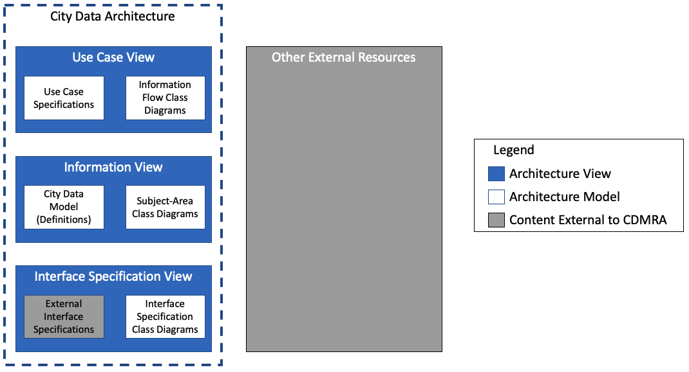
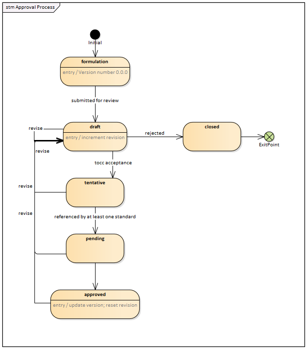
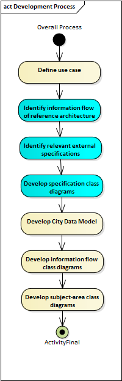

## Scope

### Scope of this document

This document defines how the content of the city data model and reference architecture (CDMRA) is developed and managed. Other documents define the details about how the CDMRA is developed and presented.

### Purpose of CDMRA

The purpose of the CDMRA is to:

1. assist experts in producing and building consensus around the definitions that are eventually captured in the city data model (CDM) portion of the CDMRA and
2. provide users of these data definitions the necessary context of the data so that they can fully appreciate the intent of the data.

These dual purposes are achieved by supplementing the CDM with the Use Case and Interface Specification Views, which provide justification and context for the data defined by the CDM.

The CDMRA formally defines the CDM; the other components of the CDMRA are only developed to the extent to support the needs of the CDM.

### Purpose of the CDM

The CDM A city data model enables city software applications to share information, plan, coordinate, and execute city tasks, and support decision making, by providing a precise, unambiguous representation of information and knowledge commonly shared within and across city services.

### Scope of services covered by the CDMRA (and CDM)

The CDMRA, and by inclusion the CDM, intends to provide a central reference for data definitions used within smart cities. However, it should be recognized that:

- smart cities encompass a huge number of potential services, including those for transport, health care, governance, power, etc.
- the CDMRA project is relatively new (starting in 2020)
- its content is dependent on the contributions of experts from the various areas of smart city services

As present, most of the work is focused on smart transport, including intelligent transport systems and transport planning, but the intent is to include all city services and experts from other service areas are encouraged to contribute.

In fact, the governance process envisioned by this document recognizes that the development of data definitions for any one smart city service often needs to consider the needs of other smart city services so that the data defined by one service can be reused by another. For example, a transport service might monitor the location of a vehicle, but a health care service might need access to that location information if a vehicle occupant has a health issue. If the two services are to be properly integrated, both the transport domain and the health care domain need to agree on how location should be defined, which requires experts from both domains to be involved in the definition of location data.

### Scope of technical specification

The CDMRA intends to define the semantics of city data to a level of detail such that it can be used as a reference for data transformations from one interface format to another. For example, it will define the meaning of data, the relationships among data, and the preferred units for data (or mechanisms for defining units of measure).

The CDM does not attempt to define representational form, encoding formats, or protocols used to exchange the data. However, before any element of the model is fully &quot;approved&quot;, at least one interface specification providing these rules must be identified and registered in the CDMRA. This ensures that the definitions provided in the model reflect real-world usage.

It is envisioned that data transformations will be defined to translate data from specific protocols into their corresponding data elements contained within the CDM. Such transformation rules will facilitate the unambiguous translation of data among different protocols and avoid mistakes in translations. The CDMRA collaboration environment makes provisions to store this type of information but this information is not currently the focus of the CDMRA development.

## Understanding the Model

While the primary goal of the CDMRA is to formally define the CDM, learning the contents of a data model by itself is a bit like trying to learn a language by reading a dictionary. In practice, data models are most useful when presented in small chunks that can be directly related to a practical use of the data.

To promote comprehension, the CDMRA adopts a use-case approach to defining data. The use cases are defined within the Use Case View of the CDMRA using a standard template. Each use case identifies the data required by the use case and typically includes one or more class diagrams that depict the relationships among this data.

The Use Case View also includes hyperlinks into the Information View, which provides additional details about the data, including:

1. Detailed definitions of each data concept required by the use case (the City Data Model)
2. Diagrams depicting how this data relates to other data (e.g., data that might not be used by the specific use case)
3. Links to each use case that uses each data element
4. Identification of interface specifications within the Interface View that define how the data is implemented in real-world interfaces
5. Links to outside resources that provide additional context for the data (e.g., external reference architectures)

The various parts of the CDMRA are summarized in Figure 1.

_Figure 1: City Data Architecture Overview_

## Contributing to the Model

The CDMRA is an open-source, collaborative product developed by and for the technical community that designs, develops, and maintains smart city services and the systems that provide these services. These services are often categorized into one of several smart city sub-areas, called domains. These domains include, but are not limited to:

- smart government
- smart transportation
- smart education
- smart health care
- smart home
- smart campus

Each of these domains are also divided into sub-domains to further refine aspects of the model.

### Approval Process

Submittals to the CDMRA can be made by any registered user of the cooperative environment, which is located at [https://www.smartdatamodel.org](https://www.smartdatamodel.org/). To register contact Mark Fox at the University of Toronto. Once registered, a user is able to select his or her domains of interest within the profile page of the website.

Registered users may submit:

- proposals for any _ **collaborative architecture element** _: these elements are fully documented and copyrighted as an integral part of the CDMRA;
- contributions of any _ **catalogued architecture element** _: these elements remain copyrighted by their original source and the CDMRA will often only include a reference to where the full definition can be found in the original source.

Catalogued architecture elements include external interface specifications and other external resources. It is envisioned that catalogued elements from multiple sources will be submitted. Each catalogued element is subject to its own copyright statement. If the source allows for reproduction of content, the submitter may provide this content along with the copyright statement that applies to the content. Sources that do not allow for reproduction shall only be referenced using fair use of its content. As the content of these external elements are defined by external organizations, no CDMRA approval process is defined other than efforts to ensure that copyrights are respected.

Collaborative architecture elements include all elements of the CDMRA, except for the external interface specifications and external resources. Submittals of collaborative elements follow the approval process depicted in Figure 2 and described below.

_Figure 2: Maturity Levels of Model Elements_

An architectural element can be initiated in the &quot;formulation&quot; state by any registered user. While in this state, the entry is publicly visible as any other entry, but is not yet flagged for review by any data steward, the originating registered user retains ownership (i.e., editing rights), and edits to the entry&#39;s attributes do not affect the version number.

Version numbers shall be in the form of &quot;\&lt;major version\&gt;.\&lt;minor version\&gt;.\&lt;revision\&gt;-\&lt;state code\&gt;&quot;. Elements in the &quot;formulation&quot; state shall always be identified as version &quot;0.0.0-F&quot;; Once the registered user is satisfied with the metadata entered for the architectural element, the element may be submitted for review, whereupon it enters the &quot;draft&quot; state and control of the element is passed to the appropriate domain data steward as defined by the domain and subdomain metadata for the element.

Upon each entry/re-entry into the &quot;draft&quot; state, the revision number is incremented to the next unique integer value for the version number; the version number does not change. Upon first entry into the &quot;draft&quot; state, each element will be identified as version &quot;0.0.1-D&quot;.

The domain data steward will review the element to determine if the element is assigned to the proper domain and subdomain. At least once a month, the domain data stewards shall review all draft data concepts to ensure that they are assigned to the proper domain(s). The current owning data steward shall implement any change to the domain and subdomain as agreed to by a simple majority of the domain data stewards present and ownership shall pass to a new data steward as the rules dictate based on these assignments.

Any registered user can review and submit comments on any collaborative architectural element within the CDMRA. Any registered user can also respond to comments submitted by others. The preferred mechanism for submitting and responding to comments is to use the discussion forum on the page of the collaborative architectural element for which the comment applies, but comments can also be verbally submitted during domain working group meetings. The domain data steward will guide these discussions towards resolution and make the changes that the working group agrees to. Each revision (or group of revisions performed in one action) to an architectural element will cause the element to be &quot;revised&quot; and re-enter the &quot;draft&quot; state, whereupon the revision number is incremented.

Once the domain working group has completed its review of the element, it can either decide to reject the draft element, whereupon it transitions to the &quot;closed&quot; state and is archived with the state code of &quot;C&quot;, or can accept the element, whereupon it transitions to the &quot;tentative&quot; state. The state code for the &quot;tentative&quot; state is &quot;T&quot; (e.g., a tentative element might have a version number of &quot;0.0.13-T&quot;).

Comments received on elements in the &quot;tentative&quot; state are handled in the same manner as with elements in the &quot;draft&quot; state. If revisions are made, the element returns to the &quot;draft&quot; state (whereupon the revision number is incremented) and may either remain there or may be elevated again by a new decision by the domain working group.

If an element in the &quot;tentative&quot; state includes a reference to at least one interface specification, it automatically transitions to the &quot;pending&quot; state, with the state code of &quot;P&quot; (e.g., version number &quot;0.0.13-P&quot;). Comments received on elements in the &quot;pending&quot; state are handled in the same manner as with elements in the &quot;draft&quot; and &quot;tentative&quot; states.

At least once a quarter, all registered users shall be notified of the elements that are in the &quot;pending&quot; state for the entire CDMRA, which will serve as a call for comments prior to formal approval. Once a specific revision of an element has been in the pending state for at least 180 days without any revisions, the working group may (but is not required to) promote the element to the &#39;approved&#39; state, with the state code of &quot;A&quot;.

Upon entry to the approved state, the version number shall be updated and the revision number shall be reset to zero. If this is the first approved version of the element or if the revisions resulted in changes that are not backwards compatible, the major version number shall be incremented and the minor version number shall be reset to zero; otherwise, the major version number shall not change and the minor version number shall increment. As a result of applying these rules, all approved elements will have a revision number of zero.

Comments received on elements in the &quot;approved&quot; state are handled in the same manner as with elements in the other states; however, elements in the approved state are permanently retained within the system for reference whereas elements in other states are only archived within the histories of what is ultimately approved or closed.

NOTE: A revision to an approved element will typically result in a revision number of one (e.g., 2.0.1-D), but can result in a higher revision number (e.g., 2.0.5-D) if a previous effort to revise the approved item failed and resulted in a closed element (e.g., 2.0.4-C).

### Preferred Sequence of Content

While contributions may be made in any order, the mandatory fields of elements are based on the general flow described in Figure 3.

_Figure 3: Process for Adding Content_

The content of the CDMRA is intended to be based on use cases so that users of the architecture can understand the context in which data might be used by end systems. The use case is formally specified using the use case template as defined by the Use Case Specification Model Kind and may include a use case diagram. The use case specification will eventually be supplemented with one or more information flow class diagrams but are typically not present upon initial submittal; rather this information is typically developed near the end of the process.

The use case specification should trace to one or more information flows, which identify the information to be exchanged to fulfil the use case. The preferred mechanism for identifying this information is to link to an external reference architecture that defines a deployment view that describes these information exchanges, but the data can be provided in simple textual form, if such a reference architecture does not exist. This description can provide valuable context for how the use case is envisioned to be implemented, but as this information typically has already been defined by outside efforts, the CDMRA does not define any conventions on how this is to be documented.

The next step in the process is to identify existing interface specifications that have already defined data for the information flow. The goal of the CDMRA is to leverage existing efforts as much as possible, but there is recognition that in many cases, there are multiple standards that define the same core data, while in other cases there might not be any standards. By explicitly identifying the source standards, we can gain a better understanding of where the entire industry is rather than basing our design off of a single effort while also informing the community of the standards that we have considered; if they are familiar with other related standards, they should be encouraged to submit this content.

Of course, the challenge in referencing a wide range of external specifications is that they will each document their data in a different manner and will typically provide much more information than what we need to show within the CDMRA. The next step is to normalize this external information into a standard presentation format by creating UML class diagrams of each data element associated with each reference interface specification for each relevant flow. This will simplify the task of deriving the CDM while also establishing the basis by which transformations of data can be documented.

Once we have identified various source interface specifications and presented their information in a normalized format, we can begin the work of specifying our data within the CDM. This effort starts with defining the key terms (i.e., the major classes within our model) and then continues to define the data elements (i.e., the properties of each class).

Once we have defined all of our data for our model, we can then prepare class diagrams for each information flow associated with our use case and link these to the use case specification for easy reference.

Finally, once we have considered multiple use cases, we can begin to build more meaningful subject-area class diagrams that show the big picture of how all of the data within a domain works together to achieve our goals.

## Roadmap

The CDMRA is intended to specify the semantics of all data concepts that might be used within a smart city environment, including data used within a single domain. This is a massive undertaking that will likely take decades to mature and will never be &quot;done&quot;. Managing such a large effort requires a management roadmap that identifies the major topics of current development and the major milestones along the way. This roadmap will be updated as the CDMRA matures and is highly dependent on the volunteer efforts from each domain.

The current roadmap focuses on activities to achieve the following major milestones in order of priority:

1. Defining the architecture framework for the CDMRA. This includes the definition of the viewpoints, model kinds, and correspondence rules that will be used to document the CDMRA per ISO 42010. It will also clearly identify the fields that are deemed to be mandatory prior to elevating an element to the &quot;tentative&quot; state.
2. Defining the governance rules for the CDMRA as proposed by this document, which defines how content is contributed and approved for the architecture.
3. Developing prototype content to demonstrate how architectural elements should be captured within the CDMRA. The current intent is that this will focus on use cases related to routing (e.g., real-time navigational routing, pre-trip navigational routing, routing of public transport lines, etc.).
4. Developing specific domains based on volunteer activity. Interest has already been expressed for the following topics:
  1. Transportation planning
  2. Kerbside management
  3. Parking management
  4. Work zone management

## Support

How does one get support in contributing to the architecture?

## Credits

The CDMRA is managed and hosted by the World Wide Web Consortium (W3C), but it represents a collaborative effort of many partners, which currently includes:

- ISO/IEC JTC1 WG 11
- ISO TC 204
- ISO TC 211
- OGC
- W3C

## Copyright

The content of the CDMRA shall by copyrighted under the ??? License.

[1](#sdfootnote1anc) The listed domains equate to the Smart Application Layer entities defined in ISO 30145-2.