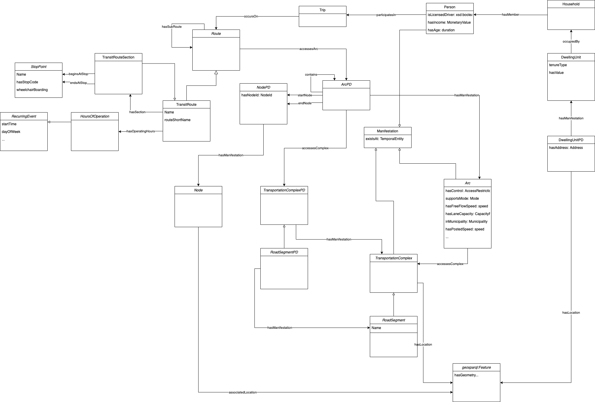

# Routes: Transportation Planning Use Case

## Usage Scenario
The city of Toronto needs to decide whether or not to approve a proposed subway line extension in the west end of the city. Supporters of the proposal claim the extension will reduce traffic congestion (and consequently carbon emissions) and improve land value. Opponents say the proposal is an unnecessary expense and that time of use restrictions would be a more effective – and less disruptive – means of reducing traffic congestion. The city planners enlist the aid of researchers at the University of Toronto to run simulations of the alternatives to help inform their decision and recommendation to the policymakers. Given sufficient data, the researchers will design and run a model to simulate the evolution of the city in the case of either alternative. The output of the simulation will provide long-term insight to the planners and policymakers that will be useful in determining what, if any, action to take.

## Basic Flow of Events
The researchers at the University of Toronto use an integrated land use and transportation simulation to assess the long-term impact of the alternatives. They develop two models; both are based on the current state of the city and its transportation network. In one model, an extension is added to the west end of the subway line. In the other model, a toll is added during peak hours to the main highway in the west end. In order to define these models, the researchers require data describing the current state of the city: its current land use and land value; the makeup of its transportation networks, including not only links and nodes but modes and capacities; and its demographic information, including attributes such as income, occupation, household composition, and extending to typical travel behaviours. Some of this data is provided by the government (city and census data), and some is obtained by other research efforts (e.g. studies and surveys). Based on each scenario, the simulation modifies the city state with individual models for demographic updates (e.g. births and deaths), labour market updates (impacting household income and place of employment), housing market updates, and automobile ownership updates. The result of each update will affect future updates to the city state; for example, if the housing market becomes more expensive, then some of the population may opt to re-locate and purchase an automobile to support their commute.

The model designed by the researchers simulates changes to the city state over a 25-year horizon, and then simulates an average day of travel behaviour with the resulting state, (25 years in the future). The travel simulation model is activity-based: routine **activities** are associates with various **demographics** (according to factors such as age, income, and occupation). These activities result in **trips** that must be performed in the **transportation network** (e.g. from home to work). Based on certain factors (e.g. automobile ownership, cost of travel), the model will generate a trip that will occur on some **route** in the network, at a particular **time of day**, with a particular **mode**(s) of transportation. The **cost** of travel considered by the model could include monetary factors such as gas and tolls, but also indirect costs such as distance, duration, and carbon emissions.

Upon termination, the simulation model will provide the following data: the updated city state (25 years into the future), a set trips representing an average day of travel behaviour in the city. Each trip will be defined according to its time of day, mode(s) used, route taken on the network, and purpo**se** (the activity, e.g. work, that motivated the trip).

The researchers will aggregate and summarize the output of the simulations for the city planners and policy makers. The data will provide insight into how the proposed alternatives and their long-term impact on the interconnected aspects of the city. For example, the extension of a subway line might be thought to relieve traffic, but the resulting increased land value, could in fact lead to increased out-migration of the population, and thus an increased number of commuters and greater stress on the vehicle network.

## Actors:

 - Policymakers
 - City planners
 - Researchers

## Risks:
- Bad data
- Bad models

## Data model:

### Relevant ontologies
[iCity TPSO report](http://ontology.eil.utoronto.ca/icity/iCityOntologyReport_1.2.pdf)

- Household: [http://ontology.eil.utoronto.ca/cdm/Household/](http://ontology.eil.utoronto.ca/cdm/Household/)
- Person: [http://ontology.eil.utoronto.ca/cdm/Person/](http://ontology.eil.utoronto.ca/cdm/Person/)- Land Use: [http://ontology.eil.utoronto.ca/cdm/LandUse/](http://ontology.eil.utoronto.ca/cdm/LandUse/)
- Transportation Network: [http://ontology.eil.utoronto.ca /cdm/TransportationSystem/](http://ontology.eil.utoronto.ca/icity/cdm/TransportationSystem/)
- Trip: [http://ontology.eil.utoronto.ca/cdm/Trip/](http://ontology.eil.utoronto.ca/cdm/Trip/)
- Trip Cost: [http://ontology.eil.utoronto.ca/cdm/TripCost/](http://ontology.eil.utoronto.ca/cdm/TripCost/)
- Travel Cost: [http://ontology.eil.utoronto.ca/cdm/TravelCost/](http://ontology.eil.utoronto.ca/cdm/TravelCost/)
- Transit: [http://ontology.eil.utoronto.ca/cdm/PublicTransit/](http://ontology.eil.utoronto.ca/cdm/PublicTransit/)

## Use case summary
| Use Case TP.1 | Transportation Planning Simulation|
|--|--|
| Goal in context | Researchers run simulations to estimate future states of the city including travel behaviour. |
| Preconditions |	Data about the current state of the city is available. A land use and travel simulation model exists.|
| Success End | Accurate estimates of the future city state and travel demands is generated. |
| Failure End |Estimates of the future city state and travel demands are not generated, or are not generated accurately.|
| Primary & Secondary Actors| 	Primary: transportation researchers   Secondary: city planners, policymakers |
|Trigger | Simulation results requested by city planners, due to some policy/planning question.|
|Description | |
|Step | Action |
|1. | Model scenarios are provided.|
|2. | Current city state data is provided.|
|3. | Land use simulation is run to output city state at t+25 years|
|4. |Travel simulation is run to output travel behaviour in future city state|
|5. | Simulation results are aggregated to provide insight into land use, transportation network supply and demand, as required.|
|Extensions||
|Step| Branching Actions|
|1a.| Multiple scenarios are provided.   This leads to multiple processes, e.g. 3a, 4a, 5a, 3b, 4b, 5b; as required to assess each scenario.|
|Required Data  (core classes)| Route decomposition (sub-routes)  Mode(s)  Actor (traveller): Income,   occupation, …   Household: collection of actors, place of residence   Land Use, location   Trip  Trip decomposition (sub-trip)  Trip cost: monetary, duration, …  Timepoints (start time, end time)   Activity (trip purpose)   Transportation Network(s): Arc, Node, Road, Road segment, Speed, Travel Cost, Access Restrictions (e.g. vehicle types prohibited), Capacity …|
